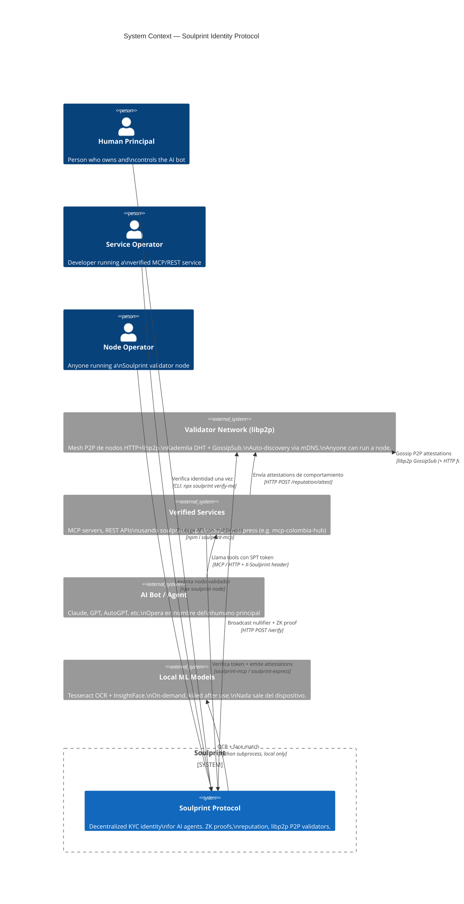
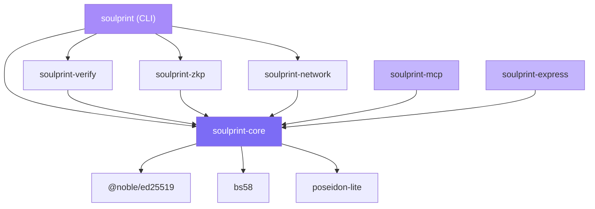

# Soulprint — Architecture (v0.1.3)

> Diagramas C4 + referencia técnica del protocolo.  
> Spec formal: [specs/SIP-v0.1.md](specs/SIP-v0.1.md)

---

## Tabla de contenidos

1. [C4 — Level 1: System Context](#c4--level-1-system-context)
2. [C4 — Level 2: Containers](#c4--level-2-containers)
3. [C4 — Level 3: Components — soulprint-core](#c4--level-3-components--soulprint-core)
4. [C4 — Level 3: Components — soulprint-network](#c4--level-3-components--soulprint-network)
5. [Trust Score Model](#trust-score-model)
6. [ZK Verification Pipeline](#zk-verification-pipeline)
7. [Token Format — SPT](#token-format--spt)
8. [Bot Reputation Layer](#bot-reputation-layer)
9. [P2P Gossip Protocol](#p2p-gossip-protocol)
10. [Multi-Country Registry](#multi-country-registry)
11. [Security Threat Matrix](#security-threat-matrix)
12. [Data Flow — Full Journey](#data-flow--full-journey)
13. [Package Dependency Graph](#package-dependency-graph)

---

## C4 — Level 1: System Context

> ¿Quién interactúa con Soulprint y con qué sistemas externos se conecta?



---

## C4 — Level 2: Containers

> ¿Cuáles son los bloques de construcción técnicos dentro de Soulprint?

```mermaid
C4Container
  title Container Diagram — Soulprint v0.2.0

  Person(human, "Human Principal", "Corre CLI para verificar identidad")
  Person(bot, "AI Bot", "Incluye SPT en tool calls")
  Person(nodeOp, "Node Operator", "Levanta un nodo validador")

  System_Boundary(sp, "Soulprint") {

    Container(cli, "soulprint (CLI)", "Node.js / TypeScript",
      "verify-me · show · renew · node · install-deps\nnpx soulprint <command>")

    Container(core, "soulprint-core", "TypeScript library",
      "DID keypairs · SPT tokens · attestations\nreputation engine · score calculator\nEd25519 + Poseidon")

    Container(verify, "soulprint-verify", "TypeScript + Python",
      "Document OCR (Tesseract)\nFace match (InsightFace)\nCountry registry (7 countries)\nMRZ ICAO 9303 validation")

    Container(zkp, "soulprint-zkp", "TypeScript + Circom",
      "Circom 2.1.8 circuit (844 constraints)\nsnarkjs Groth16 prover/verifier\nProof: ~564ms · Verify: ~25ms")

    Container(httpNode, "soulprint-network (HTTP)", "Node.js HTTP server",
      "Validator REST API (port 4888)\nZK verify · Nullifier registry\nReputation store · Rate limiting\nBootstrap de nodos legacy")

    Container(p2pNode, "soulprint-network (P2P)", "libp2p Node.js",
      "Puerto 6888 — libp2p v2.10\nKademlia DHT (peer discovery)\nGossipSub (attestation broadcast)\nmDNS (LAN auto-discovery)\nTCP + Noise + Yamux + Ping\nBootstrap via SOULPRINT_BOOTSTRAP")

    Container(mcp, "soulprint-mcp", "TypeScript",
      "MCP server middleware (3 lines)\nCapabilities-based token extraction\nScore-gated tool access")

    Container(express, "soulprint-express", "TypeScript",
      "Express / Fastify middleware\nreq.soulprint context injection\nMinScore enforcement")

    ContainerDb(fs, "Local Filesystem", "JSON files (mode 0600)",
      "~/.soulprint/keypair.json\n~/.soulprint/token.spt\n~/.soulprint/node/reputation.json\n~/.soulprint/node/nullifiers.json\n~/.soulprint/node/peers.json")
  }

  System_Ext(validatorNet, "Otros nodos Soulprint", "HTTP + libp2p peers")

  Rel(human, cli, "Corre verificación", "stdio")
  Rel(nodeOp, httpNode, "Arranca nodo", "npx soulprint node")
  Rel(cli, verify, "OCR + face match", "TypeScript import")
  Rel(cli, zkp, "Genera ZK proof", "TypeScript import")
  Rel(cli, core, "Emite SPT token", "TypeScript import")
  Rel(cli, httpNode, "Inicia HTTP validator", "TypeScript import")
  Rel(cli, p2pNode, "Inicia P2P node", "TypeScript import")
  Rel(httpNode, p2pNode, "setP2PNode() — integración", "mismo proceso")
  Rel(verify, fs, "Lee/escribe keypair", "Node.js fs")
  Rel(core, fs, "Persiste keypair + token", "Node.js fs")
  Rel(httpNode, fs, "Persiste reputación + peers", "Node.js fs")
  Rel(p2pNode, validatorNet, "Gossip attestations", "libp2p GossipSub")
  Rel(p2pNode, validatorNet, "Descubre peers", "Kademlia DHT + mDNS")
  Rel(httpNode, validatorNet, "Gossip fallback (nodos legacy)", "HTTP fire-and-forget")
  Rel(bot, mcp, "Llama con SPT en capabilities", "MCP protocol")
  Rel(bot, express, "Llama con X-Soulprint header", "HTTP")
  Rel(mcp, core, "Verifica token + extrae ctx", "TypeScript import")
  Rel(express, core, "Verifica token + extrae ctx", "TypeScript import")
  Rel(mcp, httpNode, "Envía attestations", "HTTP POST /reputation/attest")

  UpdateLayoutConfig($c4ShapeInRow="4", $c4BoundaryInRow="1")
```

---

## C4 — Level 3: Components — soulprint-core

> Los primitivos que usan todos los demás paquetes.

```mermaid
C4Component
  title Component Diagram — soulprint-core

  Container_Boundary(core, "soulprint-core") {

    Component(did, "DID Manager", "did.ts",
      "generateKeypair() → Ed25519\nDID = did:key:z6Mk + bs58(pubkey)\nloadKeypair(path) · saveKeypair(path)")

    Component(token, "Token Engine", "token.ts",
      "createToken(kp, nullifier, creds, opts)\ndecodeToken(b64) → SoulprintToken | null\nverifySig(token) → boolean\nexpiry: 24h sliding window")

    Component(attest, "Attestation Manager", "attestation.ts",
      "createAttestation(kp, targetDid, val, ctx)\nverifyAttestation(att) → boolean\nEd25519 sign/verify\nAge check (<1h)")

    Component(rep, "Reputation Engine", "reputation.ts",
      "computeReputation(atts[], base=10)\nfilter: valid sigs + dedup\nscore = clamp(base + sum, 0, 20)\ndefaultReputation() → score=10")

    Component(score, "Score Calculator", "score.ts",
      "calculateTotalScore(creds, botRep)\nidentityScore = sum(CREDENTIAL_WEIGHTS)\ntotal = clamp(identity + botRep, 0, 100)\nCREDENTIAL_WEIGHTS: {Email:8, Phone:12, ...}")

    Component(crypto, "Crypto Primitives", "crypto.ts",
      "@noble/ed25519 — sign/verify\nposeidon-lite — hash\nbs58 — base58 encode/decode\nrandomBytes — salt generation")
  }

  Container(cli, "soulprint (CLI)", "", "")
  Container(verify, "soulprint-verify", "", "")
  Container(zkp, "soulprint-zkp", "", "")
  Container(network, "soulprint-network", "", "")
  Container(mcp, "soulprint-mcp", "", "")
  Container(express, "soulprint-express", "", "")

  Rel(did, crypto, "Uses Ed25519 keygen", "")
  Rel(token, did, "Signs with DID keypair", "")
  Rel(token, crypto, "Ed25519 sign/verify", "")
  Rel(attest, crypto, "Ed25519 sign/verify", "")
  Rel(rep, attest, "Calls verifyAttestation", "")
  Rel(score, rep, "Reads botRep.score", "")

  Rel(cli, did, "generateKeypair()", "")
  Rel(cli, token, "createToken()", "")
  Rel(verify, did, "loadKeypair()", "")
  Rel(zkp, token, "embed proof in token", "")
  Rel(network, rep, "computeReputation()", "")
  Rel(network, attest, "verifyAttestation()", "")
  Rel(mcp, token, "decodeToken() · verifySig()", "")
  Rel(mcp, score, "check minScore", "")
  Rel(express, token, "decodeToken() · verifySig()", "")

  UpdateLayoutConfig($c4ShapeInRow="3", $c4BoundaryInRow="1")
```

---

## C4 — Level 3: Components — soulprint-network (HTTP)

> El nodo validador HTTP: cómo guarda y propaga la reputación.

```mermaid
C4Component
  title Component Diagram — soulprint-network / HTTP Validator (validator.ts)

  Container_Boundary(net, "soulprint-network — HTTP Layer") {

    Component(api, "REST API", "validator.ts · Node.js http",
      "GET  /health\nPOST /verify\nGET  /reputation/:did\nPOST /reputation/attest\nPOST /peers/register\nGET  /peers\nGET  /info (incluye p2p stats)")

    Component(p2pBridge, "P2P Bridge", "validator.ts",
      "setP2PNode(node):\n  inyecta libp2p node\n  suscribe a TOPIC_ATTESTATIONS\n  handler: verifyAttestation → applyAttestation\ngossipAttestation() dual-channel:\n  1. publishAttestationP2P() ← GossipSub\n  2. HTTP fire-and-forget ← fallback legacy")

    Component(repStore, "Reputation Store", "validator.ts",
      "loadReputation() / saveReputation()\ngetReputation(did) → BotReputation\napplyAttestation(att) + anti-replay\nMap<DID → { score, attestations[], last_updated }>")

    Component(sybil, "Sybil Registry", "validator.ts",
      "registerNullifier(nullifier, did)\ncheckNullifier(nullifier) → did | null\n1 nullifier = 1 DID\nPreviene registro doble")

    Component(peerMgr, "Peer Manager (legacy)", "validator.ts",
      "peers.json — nodos HTTP legacy\nregistrarPeer(url) · getPeers()\nusado como fallback cuando\nel peer no tiene libp2p")

    Component(rateLimit, "Rate Limiter", "validator.ts",
      "/attest   → 10 req/min/IP\n/verify   → 30 req/min/IP\nMap<IP → { count, resetAt }>\nauto-cleanup cada 5 min")
  }

  Container(p2pNode, "soulprint-network (P2P)", "", "")
  Container(core, "soulprint-core", "", "")
  ContainerDb(fs, "Filesystem", "JSON", "~/.soulprint/node/")

  Rel(api, rateLimit, "Todas las rutas protegidas", "")
  Rel(api, repStore, "Query/update reputación", "")
  Rel(api, sybil, "Check en /verify", "")
  Rel(api, p2pBridge, "gossipAttestation() en /attest", "")
  Rel(api, peerMgr, "Lee peers en /peers/register", "")
  Rel(p2pBridge, p2pNode, "publishAttestationP2P()", "GossipSub")
  Rel(p2pBridge, peerMgr, "HTTP fallback a peers legacy", "")
  Rel(repStore, core, "verifyAttestation()", "")
  Rel(repStore, fs, "reputation.json", "")
  Rel(sybil, fs, "nullifiers.json", "")
  Rel(peerMgr, fs, "peers.json", "")

  UpdateLayoutConfig($c4ShapeInRow="3", $c4BoundaryInRow="1")
```

---

## C4 — Level 3: Components — soulprint-network (P2P)

> La capa libp2p: cómo los nodos se descubren y propagan attestations.

```mermaid
C4Component
  title Component Diagram — soulprint-network / P2P Layer (p2p.ts) — Fase 5

  Container_Boundary(p2p, "soulprint-network — P2P Layer (libp2p v2.10)") {

    Component(nodeFactory, "Node Factory", "p2p.ts · createSoulprintP2PNode()",
      "Crea nodo libp2p con:\n  TCP transport (port 6888)\n  Noise encryption\n  Yamux multiplexing\nArranca + suscribe a topics\nDevuelve SoulprintP2PNode")

    Component(transport, "Transport Stack", "libp2p internals",
      "@libp2p/tcp — conexiones TCP\n@chainsafe/libp2p-noise — E2E encryption\n@chainsafe/libp2p-yamux — stream muxing\n@libp2p/ping — health checks (req. KadDHT)")

    Component(kademlia, "Kademlia DHT", "@libp2p/kad-dht",
      "clientMode: false (servidor)\nPeer routing y peer discovery\nXOR metric distance routing\nAuto-refresh de routing table\nPeer ID: 12D3KooW... (Ed25519)")

    Component(gossipSub, "GossipSub", "@chainsafe/libp2p-gossipsub",
      "Topic: soulprint:attestations:v1\nTopic: soulprint:nullifiers:v1\nallowPublishToZeroTopicPeers: true\nScore thresholds permisivos\n(redes pequeñas / bootstrap)")

    Component(discovery, "Peer Discovery", "multi-source",
      "@libp2p/mdns — LAN auto-discovery\n  (zero config, funciona offline)\n@libp2p/bootstrap — configurable\n  SOULPRINT_BOOTSTRAP=multiaddrs\n@libp2p/identify — intercambio\n  de protocolos y addresses")

    Component(pubsubApi, "PubSub API", "p2p.ts helpers",
      "publishAttestationP2P(node, att):\n  fromString(JSON.stringify(att))\n  pubsub.publish(TOPIC, data)\n  retorna recipients count\n\nonAttestationReceived(node, handler):\n  addEventListener('message')\n  parse + validate + callback\n\ngetP2PStats(node):\n  peerId, peers, multiaddrs, pubsubPeers\n\nstopP2PNode(node): graceful stop")
  }

  Container(httpBridge, "soulprint-network (HTTP)", "", "")
  System_Ext(peers, "Otros nodos Soulprint", "", "Mesh P2P global")

  Rel(nodeFactory, transport, "Configura transports", "")
  Rel(nodeFactory, kademlia, "services.dht = kadDHT()", "")
  Rel(nodeFactory, gossipSub, "services.pubsub = gossipsub()", "")
  Rel(nodeFactory, discovery, "peerDiscovery: [mdns(), bootstrap()]", "")
  Rel(gossipSub, pubsubApi, "expuesto via helpers", "")
  Rel(pubsubApi, httpBridge, "onAttestationReceived → applyAttestation()", "")
  Rel(gossipSub, peers, "GossipSub mesh", "libp2p TCP")
  Rel(kademlia, peers, "DHT routing table", "libp2p TCP")
  Rel(discovery, peers, "mDNS multicast / Bootstrap dial", "UDP / TCP")

  UpdateLayoutConfig($c4ShapeInRow="3", $c4BoundaryInRow="1")
```

---

## Trust Score Model

```
Total Score (0–100) = Identity Score (0–80) + Bot Reputation (0–20)
```

### Credential weights

| Credential | Points | Method |
|---|---|---|
| `EmailVerified` | 8 | Confirmation link |
| `PhoneVerified` | 12 | SMS OTP |
| `GitHubLinked` | 16 | OAuth |
| `DocumentVerified` | 20 | Tesseract OCR + ICAO 9303 MRZ |
| `FaceMatch` | 16 | InsightFace cosine ≥ 0.6 |
| `BiometricBound` | 8 | Ed25519 device binding |
| **Máximo** | **80** | |

### Access levels

| Total | Level | Acceso típico |
|---|---|---|
| 0–17 | Anonymous | Solo lectura, búsquedas |
| 18–59 | Partial | API estándar |
| 60–94 | KYCFull | Integraciones avanzadas |
| **95–100** | **Premium** | **Endpoints de alta confianza** |

### Reputación

| Score | Estado | Significado |
|---|---|---|
| 0–9 | Penalizado | Historial de abuso |
| 10 | Neutral | Bot nuevo, sin historial |
| 11–15 | Establecido | Actividad verificada |
| 16–20 | Confiable | Track record excelente |

---

## ZK Verification Pipeline

```
Device local (nada sale del dispositivo)
─────────────────────────────────────────────────────────────────────

  imagen_cedula.jpg ──▶ Tesseract OCR
                         └─▶ MRZ line 1 + line 2
                              └─▶ icaoCheckDigit() (7-3-1 mod 10)
                                   └─▶ { cedula_num, fecha_nac }

  selfie.jpg ──▶ CLAHE pre-process (LAB channel L, clipLimit=2.0)
                └─▶ InsightFace embedding [512 dims]
                     └─▶ tomar 32 primeras dimensiones
                          └─▶ round(dim, 1)  ← absorbe ruido biométrico
                               └─▶ face_key = Poseidon_iterativo(dims)

  Poseidon(cedula_num, fecha_nac, face_key) ──▶ nullifier

  Circom circuit soulprint_identity.circom
    private: { cedula_num, fecha_nac, face_key, salt }
    public:  { nullifier, context_tag }
    constraint: Poseidon(private) == nullifier
    → snarkjs.groth16.prove(wasm, zkey)
    → { proof, publicSignals }   (~564ms)

  Ed25519 DID keypair (generar o cargar de ~/.soulprint/keypair.json)
  → createToken(kp, nullifier, credentials, { zkp: proof })
  → ~/.soulprint/token.spt

  InsightFace process killed → embeddings liberados de memoria
─────────────────────────────────────────────────────────────────────
```

---

## Token Format — SPT

```typescript
interface SoulprintToken {
  // Identidad
  did:            string;       // "did:key:z6Mk..." — Ed25519 public key
  nullifier:      string;       // Poseidon hash — único por humano
  credentials:    string[];     // ["DocumentVerified","FaceMatch",...]

  // Scores
  identity_score: number;       // 0–80
  score:          number;       // 0–100 (identity + bot_rep)
  level:          string;       // "KYCFull" | "KYCPartial" | etc.

  // Reputación
  bot_rep: {
    score:        number;       // 0–20 (default=10)
    attestations: number;
    last_updated: number;
  };

  // ZK Proof
  zkp: {
    proof:         object;      // Groth16 proof
    publicSignals: string[];    // [nullifier, context_tag]
  };

  // Meta
  country:   string;            // "CO" | "MX" | ...
  issued_at: number;            // unix timestamp
  expires:   number;            // +86400 (24h)
  sig:       string;            // Ed25519(payload, privateKey)
}
```

**Tamaño:** ~700 bytes sin comprimir  
**Ciclo:** `Issue → [válido 24h] → renew` (no requiere re-verificar)

---

## Bot Reputation Layer

### Attestation format

```typescript
interface BotAttestation {
  issuer_did:  string;   // DID del servicio que emite (score >= 60)
  target_did:  string;   // DID del bot evaluado
  value:       1 | -1;
  context:     string;   // "spam-detected" | "normal-usage" | etc.
  timestamp:   number;   // unix seconds
  sig:         string;   // Ed25519(payload, issuer_privateKey)
}
```

### Guards en el nodo validador

```
POST /reputation/attest — solo acepta si:
  ✓ service_spt presente
  ✓ verifySoulprint(service_spt) === true
  ✓ service_spt.score >= 60
  ✓ service_spt.did === attestation.issuer_did
  ✓ verifyAttestation(att) === true  (Ed25519 válido)
  ✓ att.timestamp > now - 3600       (no más de 1h de antigüedad)
  ✓ no duplicado (issuer_did, timestamp, context)
```

### Construcción de reputación en el tiempo

```
Día 0   Bot creado                                    score = 10
Día 1   mcp-colombia: 3 completions sin spam  ──▶    score = 11
Día 3   servicio-B: pago completado           ──▶    score = 12
Día 5   spam detectado en servicio-C          ──▶    score = 11
Día 30  uso consistente en 5+ servicios       ──▶    score = 17

Identity (80) + Reputation (17) = 97  →  PREMIUM desbloqueado
```

---

## P2P Gossip Protocol

> Fase 5 — libp2p GossipSub + Kademlia DHT (soulprint-network@0.2.0)

### Arquitectura dual-channel

```
attestation nueva en un nodo
    │
    ├──▶ Canal 1: libp2p GossipSub (primario)
    │     publishAttestationP2P(node, att)
    │     → serialize: JSON → Uint8Array
    │     → pubsub.publish("soulprint:attestations:v1", data)
    │     → GossipSub distribuye a todos los subscribers
    │     → cada receptor: verifyAttestation() → applyAttestation()
    │
    └──▶ Canal 2: HTTP fire-and-forget (fallback nodos legacy)
          POST {peer}/reputation/attest
          headers: { "X-Gossip": "1" }
          timeout: 3000ms · catch: ignorar
```

### Flujo de descubrimiento de peers

```
Nodo arranca (npx soulprint node)
    │
    ├──▶ mDNS broadcast en LAN (zero config — funciona offline)
    │
    ├──▶ Bootstrap dial (si SOULPRINT_BOOTSTRAP env var configurada)
    │     → conecta a multiaddrs conocidas
    │     → intercambia routing table via KadDHT
    │
    └──▶ Kademlia DHT (mantenimiento continuo)
          → FIND_NODE queries (XOR metric distance)
          → routing table actualizada periódicamente

Peer ID: 12D3KooW... (Ed25519 multihash)
Multiaddr: /ip4/x.x.x.x/tcp/6888/p2p/12D3KooW...
```

### Topics PubSub

| Topic | Uso |
|---|---|
| `soulprint:attestations:v1` | Broadcast de BotAttestations |
| `soulprint:nullifiers:v1` | Reservado — anti-Sybil futuro |

### Anti-loop y anti-replay

```
GossipSub maneja anti-loop nativamente (message-id único por mensaje)
Anti-replay en applyAttestation(): dedup (issuer_did, timestamp, context)
Mismo mensaje llegando por P2P y por HTTP → solo se aplica una vez
```

### Stack libp2p (interface@2.x)

```
libp2p@2.10.0
├── @libp2p/tcp@10.1.19 · @chainsafe/libp2p-noise@16.1.5 · @chainsafe/libp2p-yamux@7.0.4
├── @libp2p/kad-dht@16.1.3 · @chainsafe/libp2p-gossipsub@14.1.2
├── @libp2p/mdns@11.0.47 · @libp2p/bootstrap@11.0.47
└── @libp2p/identify@3.0.39 · @libp2p/ping@2.0.37
```

---

## Multi-Country Registry

```
packages/verify-local/src/document/
├── verifier.interface.ts     CountryVerifier interface
├── registry.ts               getVerifier(code) · listCountries() · detectVerifier(text)
└── countries/
    ├── CO.ts  ── Completo: OCR + MRZ + face match + ICAO check digits
    ├── MX.ts  ── Parcial: número INE + validación CURP
    ├── AR.ts  ── Parcial: DNI 8 dígitos
    ├── VE.ts  ── Parcial: Cédula V/E + prefijo
    ├── PE.ts  ── Parcial: DNI 8 dígitos
    ├── BR.ts  ── Parcial: CPF mod-11 doble dígito verificador
    └── CL.ts  ── Parcial: RUN mod-11 (manejo especial de K)
```

**Agregar un país = 1 PR:** crear `XX.ts` + 1 línea en `registry.ts`. Ver [CONTRIBUTING.md](CONTRIBUTING.md).

---

## Security Threat Matrix

| Amenaza | Vector | Defensa |
|---|---|---|
| **Identidad falsa** | Documento forjado | Face match + ICAO check digits |
| **Registro doble** | Misma persona, dos DIDs | Nullifier único por biometría |
| **Score inflation** | Modificar payload del token | Firma Ed25519 cubre todo el payload |
| **DID substitution** | Reemplazar DID en token ajeno | Firma ligada al DID — mismatch = inválido |
| **Attestation forgery** | Crear +1 falso para DID propio | Firma del servicio emisor requerida |
| **Servicio de baja rep** | Servicio nuevo spamea +1 | Nodo exige service_spt.score ≥ 60 |
| **Attestation flood** | 1,000 +1 de un servicio | Score clamped en 20; rate limit 10/min/IP |
| **Replay attack** | Reusar attestation antigua | Dedup (issuer, timestamp, context) + max 1h |
| **Token replay** | Usar token de otro usuario | Expira en 24h + context_tag por servicio |
| **Sybil via nullifier** | Múltiples DIDs, mismo nullifier | Nodo: nullifier → exactamente un DID |
| **Robo de clave** | Leer `~/.soulprint/keypair.json` | Clave privada nunca se transmite; mode 0600 |

---

## Data Flow — Full Journey

```
Principal (humano)                 Bot (IA)                  Servicio
      │                               │                          │
      │ 1. npx soulprint verify-me    │                          │
      │    (OCR + face + ZK proof)    │                          │
      │    → token.spt (~700 bytes)   │                          │
      │                               │                          │
      │ 2. SOULPRINT_TOKEN=... ───────▶                          │
      │                               │                          │
      │                               │ 3. tool call             │
      │                               │  capabilities:{          │
      │                               │   soulprint: <token>     │
      │                               │  }                       │──▶ extractToken()
      │                               │                          │    verifySig()
      │                               │                          │    check expiry
      │                               │                          │    check minScore
      │                               │                          │
      │                               │                          │ 4. trackRequest(did, tool)
      │                               │                          │    → spam check
      │                               │                          │
      │                               │◀── resultado ────────────│
      │                               │                          │
      │                               │                          │ 5. trackCompletion(did, tool)
      │                               │                          │    if 3+ tools, no spam:
      │                               │                          │      issueAttestation(did, +1)
      │                               │                          │      POST /reputation/attest
      │                               │                          │         └─▶ gossip a peers
      │                               │                          │
      │ 6. npx soulprint renew        │                          │
      │    → nuevo token score=91     │                          │
      │      (80 identity + 11 rep)   │                          │
```

---

## Package Dependency Graph



---

## Appendix — File Structure

```
soulprint/
├── packages/
│   ├── cli/src/commands/        verify-me · show · renew · node · install-deps
│   ├── core/src/
│   │   ├── did.ts               DID generation (Ed25519)
│   │   ├── token.ts             SPT create / decode / verify
│   │   ├── attestation.ts       BotAttestation create / verify
│   │   ├── reputation.ts        computeReputation · defaultReputation
│   │   └── score.ts             calculateTotalScore · CREDENTIAL_WEIGHTS
│   ├── verify-local/src/
│   │   ├── face/                face_match.py (InsightFace on-demand)
│   │   └── document/countries/  CO MX AR VE PE BR CL
│   ├── zkp/
│   │   ├── circuits/            soulprint_identity.circom (844 constraints)
│   │   └── keys/                *.zkey · verification_key.json
│   ├── network/src/
│   │   ├── server.ts            Entrypoint: arranca HTTP + P2P en mismo proceso
│   │   ├── validator.ts         HTTP server + setP2PNode() bridge + gossip dual-channel
│   │   └── p2p.ts               libp2p node (Fase 5): KadDHT + GossipSub + mDNS
│   ├── mcp/src/middleware.ts    soulprint() MCP plugin
│   └── express/src/middleware.ts soulprint() Express plugin
├── tests/
│   ├── suite.js                 104 unit + integration
│   ├── pentest-node.js          15 HTTP pen tests
│   ├── zk-tests.js              16 ZK proof tests
│   └── p2p-tests.mjs            22 P2P tests (Fase 5): conectividad, GossipSub, 3 nodos, burst
├── specs/SIP-v0.1.md            Formal protocol spec
├── website/index.html           Landing page (GitHub Pages)
├── ARCHITECTURE.md              ← este archivo
└── README.md
```

---

*v0.2.0 — Febrero 2026 · https://github.com/manuelariasfz/soulprint*
