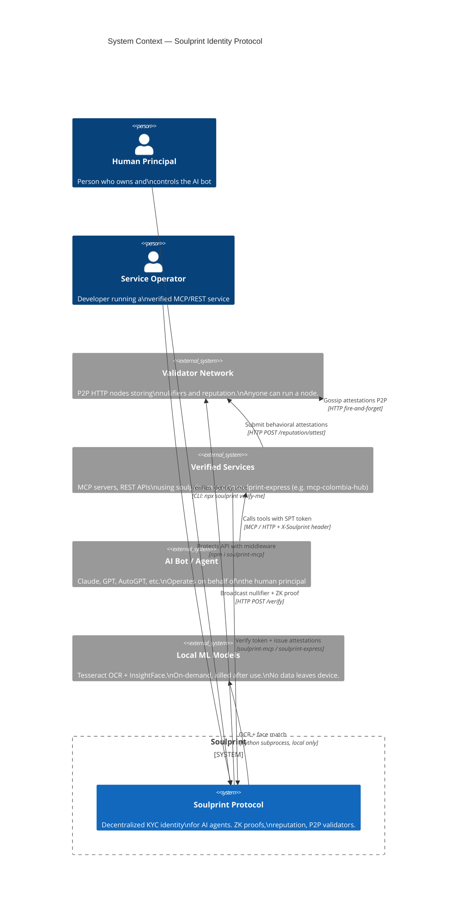
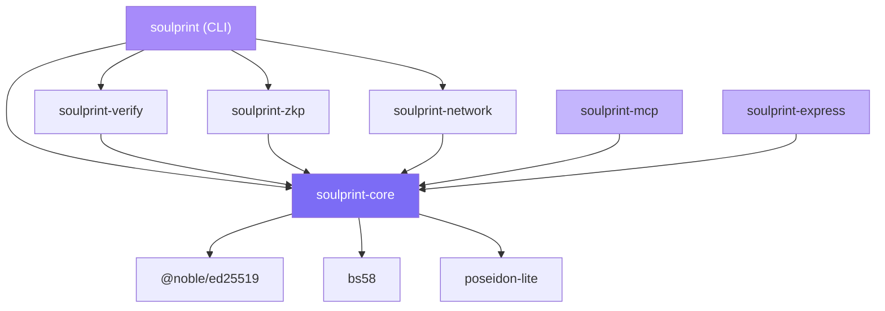

# Soulprint — Architecture (v0.1.3)

> Diagramas C4 + referencia técnica del protocolo.  
> Spec formal: [specs/SIP-v0.1.md](specs/SIP-v0.1.md)

---

## Tabla de contenidos

1. [C4 — Level 1: System Context](#c4--level-1-system-context)
2. [C4 — Level 2: Containers](#c4--level-2-containers)
3. [C4 — Level 3: Components — soulprint-core](#c4--level-3-components--soulprint-core)
4. [C4 — Level 3: Components — soulprint-network](#c4--level-3-components--soulprint-network)
5. [Trust Score Model](#trust-score-model)
6. [ZK Verification Pipeline](#zk-verification-pipeline)
7. [Token Format — SPT](#token-format--spt)
8. [Bot Reputation Layer](#bot-reputation-layer)
9. [P2P Gossip Protocol](#p2p-gossip-protocol)
10. [Multi-Country Registry](#multi-country-registry)
11. [Security Threat Matrix](#security-threat-matrix)
12. [Data Flow — Full Journey](#data-flow--full-journey)
13. [Package Dependency Graph](#package-dependency-graph)

---

## C4 — Level 1: System Context

> ¿Quién interactúa con Soulprint y con qué sistemas externos se conecta?



---

## C4 — Level 2: Containers

> ¿Cuáles son los bloques de construcción técnicos dentro de Soulprint?

```mermaid
C4Container
  title Container Diagram — Soulprint v0.1.3

  Person(human, "Human Principal", "Runs CLI to verify identity")
  Person(bot, "AI Bot", "Includes SPT in tool calls")

  System_Boundary(sp, "Soulprint") {

    Container(cli, "soulprint (CLI)", "Node.js / TypeScript",
      "verify-me · show · renew · node · install-deps\nnpx soulprint <command>")

    Container(core, "soulprint-core", "TypeScript library",
      "DID keypairs · SPT tokens · attestations\nreputation engine · score calculator\nEd25519 + Poseidon")

    Container(verify, "soulprint-verify", "TypeScript + Python",
      "Document OCR (Tesseract)\nFace match (InsightFace)\nCountry registry (7 countries)\nMRZ ICAO 9303 validation")

    Container(zkp, "soulprint-zkp", "TypeScript + Circom",
      "Circom 2.1.8 circuit (844 constraints)\nsnarkjs Groth16 prover/verifier\nProof: ~564ms · Verify: ~25ms")

    Container(network, "soulprint-network", "Node.js HTTP",
      "Validator node REST API\nReputation store · Sybil registry\nP2P gossip · Rate limiting")

    Container(mcp, "soulprint-mcp", "TypeScript",
      "MCP server middleware (3 lines)\nCapabilities-based token extraction\nScore-gated tool access")

    Container(express, "soulprint-express", "TypeScript",
      "Express / Fastify middleware\nreq.soulprint context injection\nMinScore enforcement")

    ContainerDb(fs, "Local Filesystem", "JSON files (mode 0600)",
      "~/.soulprint/keypair.json\n~/.soulprint/token.spt\n~/.soulprint/node/reputation.json\n~/.soulprint/node/nullifiers.json\n~/.soulprint/node/peers.json")
  }

  System_Ext(validatorNet, "Validator Network", "Other soulprint-network nodes")

  Rel(human, cli, "Runs verification", "stdio")
  Rel(cli, verify, "OCR + face match", "TypeScript import")
  Rel(cli, zkp, "Generate ZK proof", "TypeScript import")
  Rel(cli, core, "Issue SPT token", "TypeScript import")
  Rel(cli, network, "Start validator node", "TypeScript import")
  Rel(verify, fs, "Read/write keys", "Node.js fs")
  Rel(core, fs, "Persist keypair + token", "Node.js fs")
  Rel(network, fs, "Persist reputation + peers", "Node.js fs")
  Rel(network, validatorNet, "Gossip attestations", "HTTP fire-and-forget")
  Rel(bot, mcp, "Calls with SPT in capabilities", "MCP protocol")
  Rel(bot, express, "Calls with X-Soulprint header", "HTTP")
  Rel(mcp, core, "Verify token + extract ctx", "TypeScript import")
  Rel(express, core, "Verify token + extract ctx", "TypeScript import")
  Rel(mcp, network, "Submit attestations", "HTTP POST /reputation/attest")

  UpdateLayoutConfig($c4ShapeInRow="4", $c4BoundaryInRow="1")
```

---

## C4 — Level 3: Components — soulprint-core

> Los primitivos que usan todos los demás paquetes.

```mermaid
C4Component
  title Component Diagram — soulprint-core

  Container_Boundary(core, "soulprint-core") {

    Component(did, "DID Manager", "did.ts",
      "generateKeypair() → Ed25519\nDID = did:key:z6Mk + bs58(pubkey)\nloadKeypair(path) · saveKeypair(path)")

    Component(token, "Token Engine", "token.ts",
      "createToken(kp, nullifier, creds, opts)\ndecodeToken(b64) → SoulprintToken | null\nverifySig(token) → boolean\nexpiry: 24h sliding window")

    Component(attest, "Attestation Manager", "attestation.ts",
      "createAttestation(kp, targetDid, val, ctx)\nverifyAttestation(att) → boolean\nEd25519 sign/verify\nAge check (<1h)")

    Component(rep, "Reputation Engine", "reputation.ts",
      "computeReputation(atts[], base=10)\nfilter: valid sigs + dedup\nscore = clamp(base + sum, 0, 20)\ndefaultReputation() → score=10")

    Component(score, "Score Calculator", "score.ts",
      "calculateTotalScore(creds, botRep)\nidentityScore = sum(CREDENTIAL_WEIGHTS)\ntotal = clamp(identity + botRep, 0, 100)\nCREDENTIAL_WEIGHTS: {Email:8, Phone:12, ...}")

    Component(crypto, "Crypto Primitives", "crypto.ts",
      "@noble/ed25519 — sign/verify\nposeidon-lite — hash\nbs58 — base58 encode/decode\nrandomBytes — salt generation")
  }

  Container(cli, "soulprint (CLI)", "", "")
  Container(verify, "soulprint-verify", "", "")
  Container(zkp, "soulprint-zkp", "", "")
  Container(network, "soulprint-network", "", "")
  Container(mcp, "soulprint-mcp", "", "")
  Container(express, "soulprint-express", "", "")

  Rel(did, crypto, "Uses Ed25519 keygen", "")
  Rel(token, did, "Signs with DID keypair", "")
  Rel(token, crypto, "Ed25519 sign/verify", "")
  Rel(attest, crypto, "Ed25519 sign/verify", "")
  Rel(rep, attest, "Calls verifyAttestation", "")
  Rel(score, rep, "Reads botRep.score", "")

  Rel(cli, did, "generateKeypair()", "")
  Rel(cli, token, "createToken()", "")
  Rel(verify, did, "loadKeypair()", "")
  Rel(zkp, token, "embed proof in token", "")
  Rel(network, rep, "computeReputation()", "")
  Rel(network, attest, "verifyAttestation()", "")
  Rel(mcp, token, "decodeToken() · verifySig()", "")
  Rel(mcp, score, "check minScore", "")
  Rel(express, token, "decodeToken() · verifySig()", "")

  UpdateLayoutConfig($c4ShapeInRow="3", $c4BoundaryInRow="1")
```

---

## C4 — Level 3: Components — soulprint-network

> El nodo validador: cómo guarda y propaga la reputación.

```mermaid
C4Component
  title Component Diagram — soulprint-network (Validator Node)

  Container_Boundary(net, "soulprint-network") {

    Component(api, "REST API", "node.ts · Express",
      "GET  /health\nPOST /verify\nGET  /reputation/:did\nPOST /reputation/attest\nPOST /peers/register\nGET  /peers")

    Component(repStore, "Reputation Store", "reputation.ts",
      "loadReputation() / saveReputation()\ngetReputation(did) → BotReputation\napplyAttestation(att)\nMap<DID → { score, attestations[], last_updated }>")

    Component(sybil, "Sybil Registry", "sybil.ts",
      "registerNullifier(nullifier, did)\ncheckNullifier(nullifier) → did | null\nEnforces: 1 nullifier = 1 DID\nPrevents same person registering twice")

    Component(gossip, "P2P Gossip", "gossip.ts",
      "gossipAttestation(att, origin)\nFetch peers from peers.json\nPOST att to each peer (fire-and-forget)\nSkip origin peer (anti-echo)\nX-Gossip:1 header = no re-gossip")

    Component(peerMgr, "Peer Manager", "peers.ts",
      "registerPeer(url)\ngetPeers() → string[]\nloadPeers() / savePeers()\nstored at ~/.soulprint/node/peers.json")

    Component(rateLimit, "Rate Limiter", "middleware.ts",
      "/attest   → 10 req/min/IP\n/verify   → 30 req/min/IP\n/reputation → 60 req/min/IP\nexpress-rate-limit")
  }

  Container_Ext(peers, "Peer Nodes", "", "Other soulprint-network instances")
  Container(core, "soulprint-core", "", "")
  ContainerDb(fs, "Filesystem", "JSON", "~/.soulprint/node/")

  Rel(api, rateLimit, "All routes protected", "Express middleware")
  Rel(api, repStore, "Query/update reputation", "")
  Rel(api, sybil, "Check on /verify", "")
  Rel(api, gossip, "Trigger on /attest", "")
  Rel(api, peerMgr, "Read/write on /peers", "")
  Rel(repStore, core, "verifyAttestation()", "")
  Rel(repStore, fs, "reputation.json", "")
  Rel(sybil, fs, "nullifiers.json", "")
  Rel(peerMgr, fs, "peers.json", "")
  Rel(gossip, peerMgr, "Fetch peer list", "")
  Rel(gossip, peers, "HTTP POST /reputation/attest", "fire-and-forget")

  UpdateLayoutConfig($c4ShapeInRow="3", $c4BoundaryInRow="1")
```

---

## Trust Score Model

```
Total Score (0–100) = Identity Score (0–80) + Bot Reputation (0–20)
```

### Credential weights

| Credential | Points | Method |
|---|---|---|
| `EmailVerified` | 8 | Confirmation link |
| `PhoneVerified` | 12 | SMS OTP |
| `GitHubLinked` | 16 | OAuth |
| `DocumentVerified` | 20 | Tesseract OCR + ICAO 9303 MRZ |
| `FaceMatch` | 16 | InsightFace cosine ≥ 0.6 |
| `BiometricBound` | 8 | Ed25519 device binding |
| **Máximo** | **80** | |

### Access levels

| Total | Level | Acceso típico |
|---|---|---|
| 0–17 | Anonymous | Solo lectura, búsquedas |
| 18–59 | Partial | API estándar |
| 60–94 | KYCFull | Integraciones avanzadas |
| **95–100** | **Premium** | **Endpoints de alta confianza** |

### Reputación

| Score | Estado | Significado |
|---|---|---|
| 0–9 | Penalizado | Historial de abuso |
| 10 | Neutral | Bot nuevo, sin historial |
| 11–15 | Establecido | Actividad verificada |
| 16–20 | Confiable | Track record excelente |

---

## ZK Verification Pipeline

```
Device local (nada sale del dispositivo)
─────────────────────────────────────────────────────────────────────

  imagen_cedula.jpg ──▶ Tesseract OCR
                         └─▶ MRZ line 1 + line 2
                              └─▶ icaoCheckDigit() (7-3-1 mod 10)
                                   └─▶ { cedula_num, fecha_nac }

  selfie.jpg ──▶ CLAHE pre-process (LAB channel L, clipLimit=2.0)
                └─▶ InsightFace embedding [512 dims]
                     └─▶ tomar 32 primeras dimensiones
                          └─▶ round(dim, 1)  ← absorbe ruido biométrico
                               └─▶ face_key = Poseidon_iterativo(dims)

  Poseidon(cedula_num, fecha_nac, face_key) ──▶ nullifier

  Circom circuit soulprint_identity.circom
    private: { cedula_num, fecha_nac, face_key, salt }
    public:  { nullifier, context_tag }
    constraint: Poseidon(private) == nullifier
    → snarkjs.groth16.prove(wasm, zkey)
    → { proof, publicSignals }   (~564ms)

  Ed25519 DID keypair (generar o cargar de ~/.soulprint/keypair.json)
  → createToken(kp, nullifier, credentials, { zkp: proof })
  → ~/.soulprint/token.spt

  InsightFace process killed → embeddings liberados de memoria
─────────────────────────────────────────────────────────────────────
```

---

## Token Format — SPT

```typescript
interface SoulprintToken {
  // Identidad
  did:            string;       // "did:key:z6Mk..." — Ed25519 public key
  nullifier:      string;       // Poseidon hash — único por humano
  credentials:    string[];     // ["DocumentVerified","FaceMatch",...]

  // Scores
  identity_score: number;       // 0–80
  score:          number;       // 0–100 (identity + bot_rep)
  level:          string;       // "KYCFull" | "KYCPartial" | etc.

  // Reputación
  bot_rep: {
    score:        number;       // 0–20 (default=10)
    attestations: number;
    last_updated: number;
  };

  // ZK Proof
  zkp: {
    proof:         object;      // Groth16 proof
    publicSignals: string[];    // [nullifier, context_tag]
  };

  // Meta
  country:   string;            // "CO" | "MX" | ...
  issued_at: number;            // unix timestamp
  expires:   number;            // +86400 (24h)
  sig:       string;            // Ed25519(payload, privateKey)
}
```

**Tamaño:** ~700 bytes sin comprimir  
**Ciclo:** `Issue → [válido 24h] → renew` (no requiere re-verificar)

---

## Bot Reputation Layer

### Attestation format

```typescript
interface BotAttestation {
  issuer_did:  string;   // DID del servicio que emite (score >= 60)
  target_did:  string;   // DID del bot evaluado
  value:       1 | -1;
  context:     string;   // "spam-detected" | "normal-usage" | etc.
  timestamp:   number;   // unix seconds
  sig:         string;   // Ed25519(payload, issuer_privateKey)
}
```

### Guards en el nodo validador

```
POST /reputation/attest — solo acepta si:
  ✓ service_spt presente
  ✓ verifySoulprint(service_spt) === true
  ✓ service_spt.score >= 60
  ✓ service_spt.did === attestation.issuer_did
  ✓ verifyAttestation(att) === true  (Ed25519 válido)
  ✓ att.timestamp > now - 3600       (no más de 1h de antigüedad)
  ✓ no duplicado (issuer_did, timestamp, context)
```

### Construcción de reputación en el tiempo

```
Día 0   Bot creado                                    score = 10
Día 1   mcp-colombia: 3 completions sin spam  ──▶    score = 11
Día 3   servicio-B: pago completado           ──▶    score = 12
Día 5   spam detectado en servicio-C          ──▶    score = 11
Día 30  uso consistente en 5+ servicios       ──▶    score = 17

Identity (80) + Reputation (17) = 97  →  PREMIUM desbloqueado
```

---

## P2P Gossip Protocol

```
Nodo A recibe attestation válida
    │
    ├─▶ Almacena localmente en reputation.json
    │
    ├─▶ Obtiene peers[] de peers.json
    │
    └─▶ Para cada peer ≠ origin (en paralelo):
          POST {peer}/reputation/attest
          headers: { "X-Gossip": "1" }
          body: { attestation }
          timeout: 3000ms
          catch: ignorar (fire-and-forget)

Anti-loop:   si X-Gossip: "1" presente → almacenar, NO re-gossipear
Anti-replay: duplicados (issuer_did, timestamp, context) ignorados
Convergencia: todos los nodos sincronizan en segundos (red pequeña)

Roadmap Fase 5: reemplazar HTTP gossip con libp2p DHT (Kademlia)
```

---

## Multi-Country Registry

```
packages/verify-local/src/document/
├── verifier.interface.ts     CountryVerifier interface
├── registry.ts               getVerifier(code) · listCountries() · detectVerifier(text)
└── countries/
    ├── CO.ts  ── Completo: OCR + MRZ + face match + ICAO check digits
    ├── MX.ts  ── Parcial: número INE + validación CURP
    ├── AR.ts  ── Parcial: DNI 8 dígitos
    ├── VE.ts  ── Parcial: Cédula V/E + prefijo
    ├── PE.ts  ── Parcial: DNI 8 dígitos
    ├── BR.ts  ── Parcial: CPF mod-11 doble dígito verificador
    └── CL.ts  ── Parcial: RUN mod-11 (manejo especial de K)
```

**Agregar un país = 1 PR:** crear `XX.ts` + 1 línea en `registry.ts`. Ver [CONTRIBUTING.md](CONTRIBUTING.md).

---

## Security Threat Matrix

| Amenaza | Vector | Defensa |
|---|---|---|
| **Identidad falsa** | Documento forjado | Face match + ICAO check digits |
| **Registro doble** | Misma persona, dos DIDs | Nullifier único por biometría |
| **Score inflation** | Modificar payload del token | Firma Ed25519 cubre todo el payload |
| **DID substitution** | Reemplazar DID en token ajeno | Firma ligada al DID — mismatch = inválido |
| **Attestation forgery** | Crear +1 falso para DID propio | Firma del servicio emisor requerida |
| **Servicio de baja rep** | Servicio nuevo spamea +1 | Nodo exige service_spt.score ≥ 60 |
| **Attestation flood** | 1,000 +1 de un servicio | Score clamped en 20; rate limit 10/min/IP |
| **Replay attack** | Reusar attestation antigua | Dedup (issuer, timestamp, context) + max 1h |
| **Token replay** | Usar token de otro usuario | Expira en 24h + context_tag por servicio |
| **Sybil via nullifier** | Múltiples DIDs, mismo nullifier | Nodo: nullifier → exactamente un DID |
| **Robo de clave** | Leer `~/.soulprint/keypair.json` | Clave privada nunca se transmite; mode 0600 |

---

## Data Flow — Full Journey

```
Principal (humano)                 Bot (IA)                  Servicio
      │                               │                          │
      │ 1. npx soulprint verify-me    │                          │
      │    (OCR + face + ZK proof)    │                          │
      │    → token.spt (~700 bytes)   │                          │
      │                               │                          │
      │ 2. SOULPRINT_TOKEN=... ───────▶                          │
      │                               │                          │
      │                               │ 3. tool call             │
      │                               │  capabilities:{          │
      │                               │   soulprint: <token>     │
      │                               │  }                       │──▶ extractToken()
      │                               │                          │    verifySig()
      │                               │                          │    check expiry
      │                               │                          │    check minScore
      │                               │                          │
      │                               │                          │ 4. trackRequest(did, tool)
      │                               │                          │    → spam check
      │                               │                          │
      │                               │◀── resultado ────────────│
      │                               │                          │
      │                               │                          │ 5. trackCompletion(did, tool)
      │                               │                          │    if 3+ tools, no spam:
      │                               │                          │      issueAttestation(did, +1)
      │                               │                          │      POST /reputation/attest
      │                               │                          │         └─▶ gossip a peers
      │                               │                          │
      │ 6. npx soulprint renew        │                          │
      │    → nuevo token score=91     │                          │
      │      (80 identity + 11 rep)   │                          │
```

---

## Package Dependency Graph



---

## Appendix — File Structure

```
soulprint/
├── packages/
│   ├── cli/src/commands/        verify-me · show · renew · node · install-deps
│   ├── core/src/
│   │   ├── did.ts               DID generation (Ed25519)
│   │   ├── token.ts             SPT create / decode / verify
│   │   ├── attestation.ts       BotAttestation create / verify
│   │   ├── reputation.ts        computeReputation · defaultReputation
│   │   └── score.ts             calculateTotalScore · CREDENTIAL_WEIGHTS
│   ├── verify-local/src/
│   │   ├── face/                face_match.py (InsightFace on-demand)
│   │   └── document/countries/  CO MX AR VE PE BR CL
│   ├── zkp/
│   │   ├── circuits/            soulprint_identity.circom (844 constraints)
│   │   └── keys/                *.zkey · verification_key.json
│   ├── network/src/
│   │   ├── node.ts              HTTP server (Express)
│   │   ├── gossip.ts            P2P fire-and-forget
│   │   └── sybil.ts             nullifier registry
│   ├── mcp/src/middleware.ts    soulprint() MCP plugin
│   └── express/src/middleware.ts soulprint() Express plugin
├── tests/
│   ├── suite.js                 104 unit + integration
│   ├── pentest-node.js          15 HTTP pen tests
│   └── zk-tests.js              16 ZK proof tests
├── specs/SIP-v0.1.md            Formal protocol spec
├── website/index.html           Landing page (GitHub Pages)
├── ARCHITECTURE.md              ← este archivo
└── README.md
```

---

*v0.1.3 — Febrero 2026 · https://github.com/manuelariasfz/soulprint*
