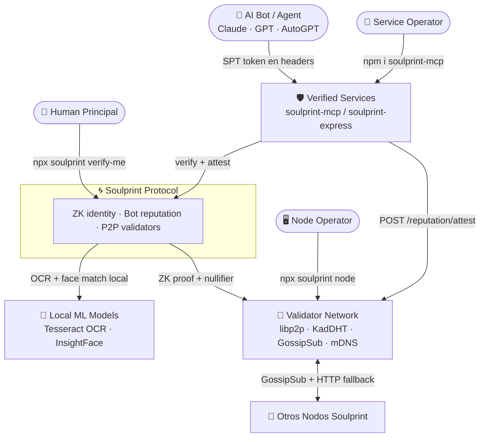
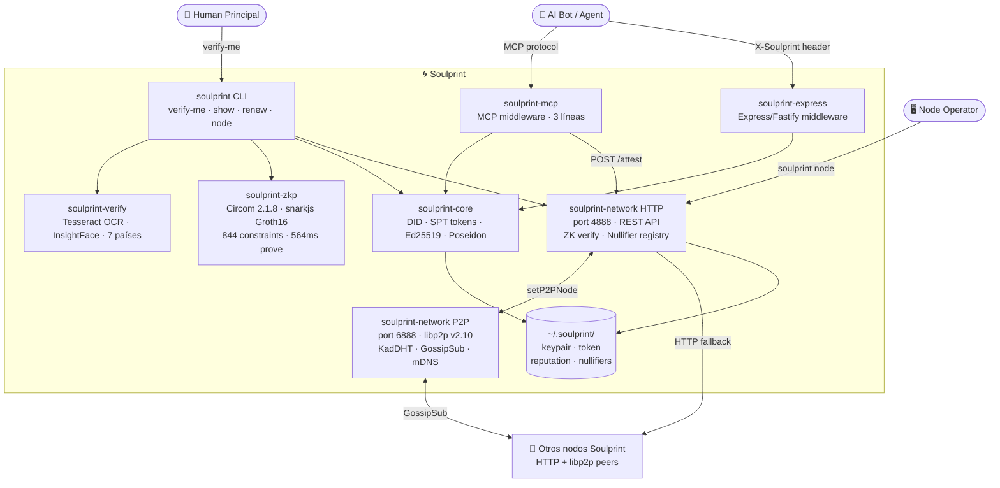
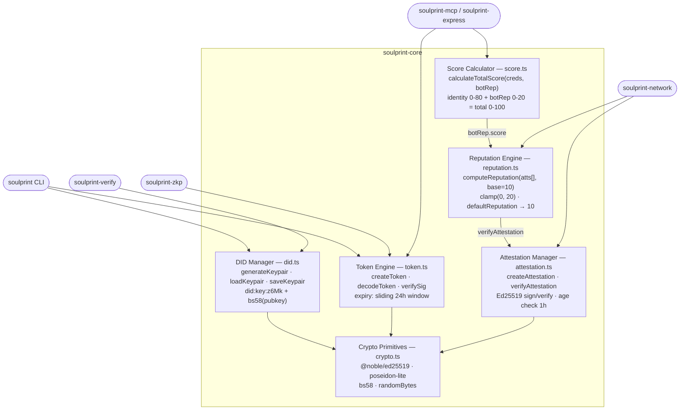
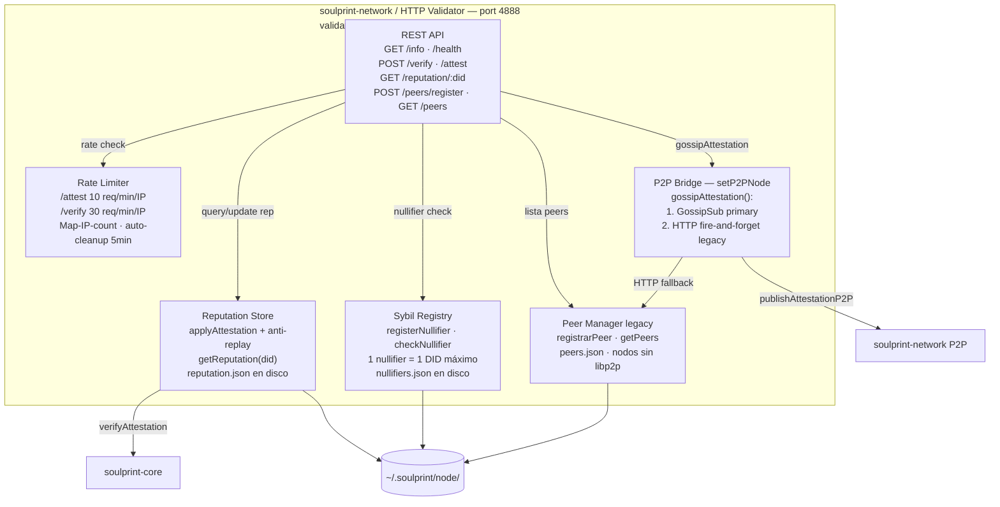
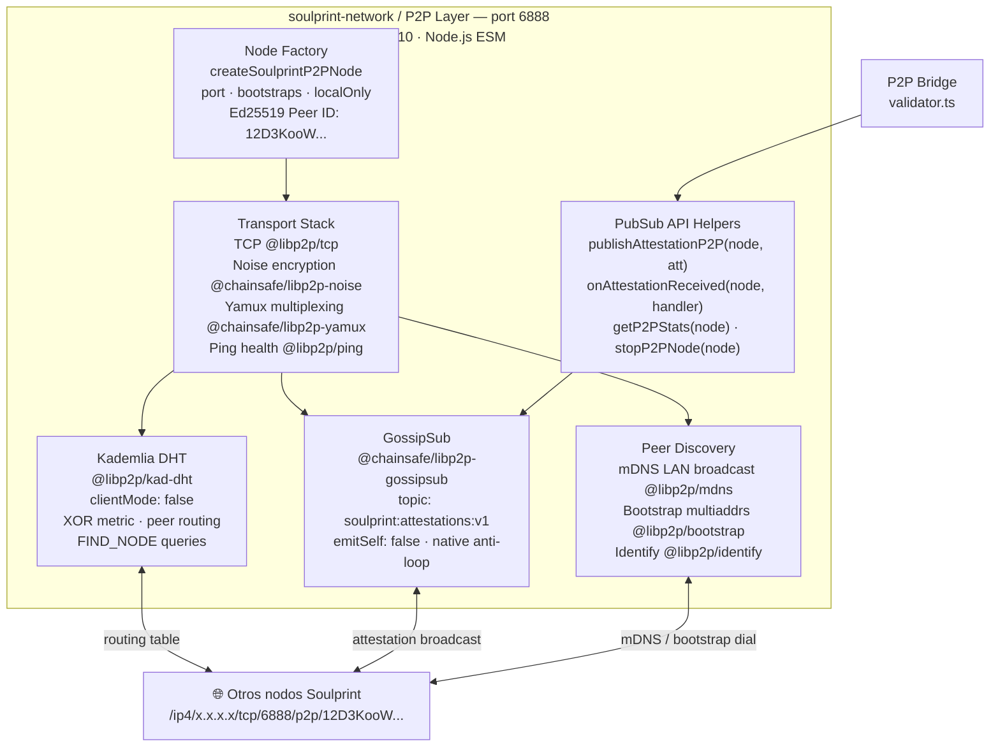
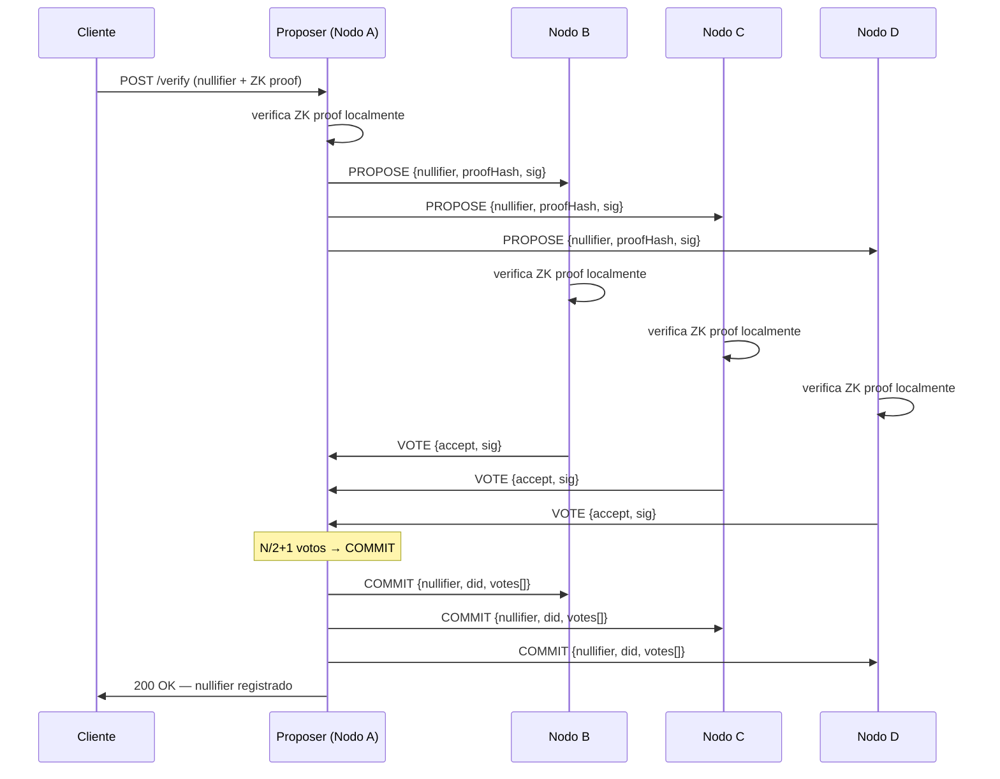
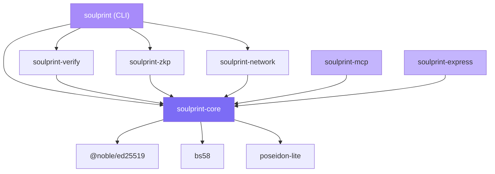

# Soulprint — Architecture (v0.3.5)

> Cada diagrama C4 tiene **dos formatos**:
> - 🖼️ **Mermaid** — se renderiza visualmente en GitHub (para humanos)
> - 📝 **ASCII** — texto plano para LLMs y herramientas que procesan markdown
>
> Spec formal: [specs/SIP-v0.1.md](specs/SIP-v0.1.md)

---

## Tabla de contenidos

1. [C4 — Level 1: System Context](#c4--level-1-system-context)
2. [C4 — Level 2: Containers](#c4--level-2-containers)
3. [C4 — Level 3: Components — soulprint-core](#c4--level-3-components--soulprint-core)
4. [C4 — Level 3: Components — soulprint-network (HTTP)](#c4--level-3-components--soulprint-network-http)
5. [C4 — Level 3: Components — soulprint-network (P2P)](#c4--level-3-components--soulprint-network-p2p)
6. [Trust Score Model](#trust-score-model)
7. [ZK Verification Pipeline](#zk-verification-pipeline)
8. [Token Format — SPT](#token-format--spt)
9. [Bot Reputation Layer](#bot-reputation-layer)
10. [P2P Gossip Protocol](#p2p-gossip-protocol)
11. [BFT P2P Consensus (v0.3.1)](#bft-p2p-consensus-v031)
12. [Multi-Country Registry](#multi-country-registry)
13. [Security Threat Matrix](#security-threat-matrix)
14. [Data Flow — Full Journey](#data-flow--full-journey)
15. [Package Dependency Graph](#package-dependency-graph)

---

## C4 — Level 1: System Context

> ¿Quién interactúa con Soulprint y con qué sistemas externos se conecta?



> **📝 ASCII — para LLMs**

```
Personas:
  [Human Principal]    — verifica identidad (npx soulprint verify-me)
  [Service Operator]   — protege API con soulprint-mcp / soulprint-express
  [Node Operator]      — levanta nodo validador (npx soulprint node)

Sistema central:
  ┌──────────────────────────────────────────────────────┐
  │                   SOULPRINT PROTOCOL                 │
  │  ZK identity · Bot reputation · P2P validators       │
  └──────────────────────────────────────────────────────┘

Sistemas externos:
  [Validator Network]  — mesh libp2p: KadDHT + GossipSub + mDNS
  [Verified Services]  — MCP servers / REST APIs (e.g. mcp-colombia-hub)
  [AI Bot / Agent]     — Claude, GPT, AutoGPT — opera por el humano
  [Local ML Models]    — Tesseract OCR + InsightFace (on-device, killed after)

Relaciones:
  Human Principal   ──verify-me──▶  Soulprint  ──OCR+face──▶  Local ML
  Soulprint         ──ZK proof──▶   Validator Network
  AI Bot            ──SPT token──▶  Verified Services
  Verified Services ──verify──▶     Soulprint
  Verified Services ──attest──▶     Validator Network
  Validator Network ──GossipSub──▶  Validator Network  (P2P mesh)
  Node Operator     ──deploy──▶     Validator Network
```

---

## C4 — Level 2: Containers

> ¿Cuáles son los bloques de construcción técnicos dentro de Soulprint?



> **📝 ASCII — para LLMs**

```
                        ┌────────────────────────────────────────────────────┐
                        │              soulprint (CLI)                       │
                        │   verify-me · show · renew · node · install-deps   │
                        └──┬──────────┬──────────┬───────────┬───────────────┘
                           │          │          │           │
                    ┌──────▼───┐ ┌────▼────┐ ┌──▼──────┐ ┌──▼─────────────────┐
                    │soulprint │ │soulprint│ │soulprint│ │soulprint-network   │
                    │ -verify  │ │  -zkp   │ │  -core  │ │                    │
                    │ TS+Python│ │Circom + │ │DID·SPT  │ │ HTTP (port 4888)   │
                    │OCR+InsF  │ │snarkjs  │ │Ed25519  │ │ P2P  (port 6888)   │
                    │7 países  │ │844 cnst │ │Poseidon │ │ KadDHT+GossipSub   │
                    └──────────┘ └─────────┘ └────┬────┘ └────────────────────┘
                                                  │
                    ┌─────────────────────────────┼──────────────────────────────┐
                    │                             │                              │
             ┌──────▼──────┐             ┌────────▼──────┐              ┌───────▼──────┐
             │soulprint-mcp│             │ soulprint-    │              │ Filesystem   │
             │ MCP server  │             │  express      │              │ ~/.soulprint/│
             │ middleware  │             │  Express/     │              │ keypair.json │
             │ 3 lines     │             │  Fastify mw   │              │ token.spt    │
             └─────────────┘             └───────────────┘              │ reputation   │
                                                                         │ nullifiers   │
                                                                         └──────────────┘
Nota: soulprint-network tiene dos sub-procesos en el mismo proceso:
  ├── HTTP validator (port 4888): REST API, ZK verify, nullifier registry, rate limit
  └── P2P libp2p    (port 6888): KadDHT, GossipSub, mDNS, Bootstrap, Noise+Yamux+TCP
```

> Los primitivos que usan todos los demás paquetes.



> **📝 ASCII — para LLMs**

```
                        ┌──────────────────────────────────────┐
                        │          soulprint-core              │
                        │  (base de todos los demás paquetes)  │
                        └──────────────────────────────────────┘

  ┌──────────────────┐   ┌──────────────────┐   ┌─────────────────────────┐
  │   DID Manager    │   │  Token Engine    │   │  Attestation Manager    │
  │    (did.ts)      │   │   (token.ts)     │   │   (attestation.ts)      │
  │                  │   │                  │   │                         │
  │generateKeypair() │   │createToken()     │   │createAttestation()      │
  │loadKeypair()     │──▶│decodeToken()     │   │verifyAttestation()      │
  │saveKeypair()     │   │verifySig()       │   │Ed25519 sign + verify    │
  │did:key:z6Mk...   │   │expiry: +24h      │   │age check (<1h)          │
  └────────┬─────────┘   └────────┬─────────┘   └──────────┬──────────────┘
           │                      │                         │
           ▼                      ▼                         ▼
  ┌──────────────────────────────────────────────────────────────────────┐
  │                     Crypto Primitives (crypto.ts)                   │
  │   @noble/ed25519 · poseidon-lite · bs58 · randomBytes              │
  └──────────────────────────────────────────────────────────────────────┘
           │
  ┌────────▼─────────┐   ┌──────────────────────────────────────────────┐
  │ Reputation Engine│   │         Score Calculator (score.ts)          │
  │ (reputation.ts)  │   │                                              │
  │                  │   │ calculateTotalScore(creds, botRep)           │
  │computeReputation │   │ CREDENTIAL_WEIGHTS:                         │
  │ (atts[], base=10)│──▶│   Email:8 · Phone:12 · GitHub:16            │
  │ clamp(0, 20)     │   │   Document:20 · FaceMatch:16 · Biometric:8  │
  │defaultReputation │   │ total = identity(0-80) + botRep(0-20)      │
  └──────────────────┘   └──────────────────────────────────────────────┘

Consumidores:
  CLI → DID Manager + Token Engine
  soulprint-network → Reputation Engine + Attestation Manager
  soulprint-mcp/express → Token Engine + Score Calculator
```

> El nodo validador HTTP: cómo guarda y propaga la reputación.



> **📝 ASCII — para LLMs**

```
                ┌─────────────────────────────────────────────────────┐
                │      soulprint-network — HTTP Validator (port 4888) │
                │      validator.ts — Node.js built-in http module     │
                └─────────────────────────────────────────────────────┘
                          │
          ┌───────────────┼───────────────────────────────┐
          │               │                               │
          ▼               ▼                               ▼
  ┌───────────────┐ ┌─────────────────┐         ┌──────────────────────┐
  │  Rate Limiter │ │  REST API        │         │     P2P Bridge       │
  │               │ │                 │         │   (setP2PNode)        │
  │ /attest 10/m  │ │ GET  /info      │         │                      │
  │ /verify 30/m  │ │ POST /verify    │         │ gossipAttestation()  │
  │ Map<IP,count> │ │ POST /attest    │─────────▶ Canal 1: GossipSub   │
  └───────────────┘ │ GET  /rep/:did  │         │ Canal 2: HTTP legacy │
                    │ POST /peers/reg │         │                      │
                    │ GET  /peers     │         │ onAttestationReceived│
                    └────────┬────────┘         │ → applyAttestation() │
                             │                  └──────────────────────┘
              ┌──────────────┼─────────────┐
              ▼              ▼             ▼
   ┌───────────────┐ ┌────────────┐ ┌─────────────┐
   │ Reputation    │ │   Sybil    │ │Peer Manager │
   │ Store         │ │ Registry   │ │  (legacy)   │
   │               │ │            │ │             │
   │ applyAttest() │ │1 nullifier │ │ peers.json  │
   │ anti-replay   │ │= 1 DID     │ │ HTTP nodos  │
   │ reputation.   │ │nullifiers. │ │ sin libp2p  │
   │  json (disk)  │ │  json      │ └─────────────┘
   └───────────────┘ └────────────┘
```

> La capa libp2p: cómo los nodos se descubren y propagan attestations.



> **📝 ASCII — para LLMs**

```
                ┌─────────────────────────────────────────────────────┐
                │   soulprint-network — P2P Layer (port 6888)         │
                │   p2p.ts — libp2p v2.10 (ESM, Node.js ≥18)         │
                └─────────────────────────────────────────────────────┘
                          │ createSoulprintP2PNode({ port, bootstraps, localOnly })
                          ▼
  ┌─────────────────────────────────────────────────────────────────────┐
  │                     Transport Stack                                  │
  │   TCP (@libp2p/tcp) → Noise encryption (@chainsafe/libp2p-noise)    │
  │   → Yamux multiplexing (@chainsafe/libp2p-yamux)                    │
  │   → Ping health checks (@libp2p/ping)   [requerido por KadDHT]     │
  └──────────────────────────────┬──────────────────────────────────────┘
                                 │
           ┌─────────────────────┼───────────────────────┐
           │                     │                       │
           ▼                     ▼                       ▼
  ┌─────────────────┐  ┌─────────────────────┐  ┌──────────────────────┐
  │  Kademlia DHT   │  │     GossipSub        │  │   Peer Discovery     │
  │ @libp2p/kad-dht │  │ @chainsafe/libp2p    │  │                      │
  │                 │  │     -gossipsub       │  │ mDNS: LAN broadcast  │
  │ clientMode:false│  │                      │  │  (zero config)       │
  │ FIND_NODE XOR   │  │ topic:               │  │ Bootstrap: multiaddrs│
  │ routing table   │  │ soulprint:attest:v1  │  │  (via SOULPRINT_     │
  │ peer routing    │  │ emitSelf: false      │  │   BOOTSTRAP env var) │
  │ internet-wide   │  │ publish → recipients │  │ Identify: protcls    │
  └─────────────────┘  └──────────┬──────────┘  └──────────────────────┘
                                  │
                    ┌─────────────▼────────────────┐
                    │       PubSub API helpers      │
                    │  publishAttestationP2P(node,  │
                    │    att) → recipients: number  │
                    │  onAttestationReceived(node,  │
                    │    handler(att, fromPeer))     │
                    │  getP2PStats(node) →          │
                    │    peerId, peers, multiaddrs  │
                    │  stopP2PNode(node)            │
                    └───────────────────────────────┘
                                  │
                   ───────────────▼──────────────────
                   → Peer ID: 12D3KooW... (Ed25519)
                   → Multiaddr: /ip4/x.x.x.x/tcp/6888/p2p/12D3KooW...
                   → GossipSub mesh ←→ otros nodos Soulprint
```

```
Total Score (0–100) = Identity Score (0–80) + Bot Reputation (0–20)
```

### Credential weights

| Credential | Points | Method |
|---|---|---|
| `EmailVerified` | 8 | Confirmation link |
| `PhoneVerified` | 12 | SMS OTP |
| `GitHubLinked` | 16 | OAuth |
| `DocumentVerified` | 20 | Tesseract OCR + ICAO 9303 MRZ |
| `FaceMatch` | 16 | InsightFace cosine ≥ 0.6 |
| `BiometricBound` | 8 | Ed25519 device binding |
| **Máximo** | **80** | |

### Access levels

| Total | Level | Acceso típico |
|---|---|---|
| 0–17 | Anonymous | Solo lectura, búsquedas |
| 18–59 | Partial | API estándar |
| 60–94 | KYCFull | Integraciones avanzadas |
| **95–100** | **Premium** | **Endpoints de alta confianza** |

### Reputación

| Score | Estado | Significado |
|---|---|---|
| 0–9 | Penalizado | Historial de abuso |
| 10 | Neutral | Bot nuevo, sin historial |
| 11–15 | Establecido | Actividad verificada |
| 16–20 | Confiable | Track record excelente |

---

## ZK Verification Pipeline

```
Device local (nada sale del dispositivo)
─────────────────────────────────────────────────────────────────────

  imagen_cedula.jpg ──▶ Tesseract OCR
                         └─▶ MRZ line 1 + line 2
                              └─▶ icaoCheckDigit() (7-3-1 mod 10)
                                   └─▶ { cedula_num, fecha_nac }

  selfie.jpg ──▶ CLAHE pre-process (LAB channel L, clipLimit=2.0)
                └─▶ InsightFace embedding [512 dims]
                     └─▶ tomar 32 primeras dimensiones
                          └─▶ round(dim, 1)  ← absorbe ruido biométrico
                               └─▶ face_key = Poseidon_iterativo(dims)

  Poseidon(cedula_num, fecha_nac, face_key) ──▶ nullifier

  Circom circuit soulprint_identity.circom
    private: { cedula_num, fecha_nac, face_key, salt }
    public:  { nullifier, context_tag }
    constraint: Poseidon(private) == nullifier
    → snarkjs.groth16.prove(wasm, zkey)
    → { proof, publicSignals }   (~564ms)

  Ed25519 DID keypair (generar o cargar de ~/.soulprint/keypair.json)
  → createToken(kp, nullifier, credentials, { zkp: proof })
  → ~/.soulprint/token.spt

  InsightFace process killed → embeddings liberados de memoria
─────────────────────────────────────────────────────────────────────
```

---

## Token Format — SPT

```typescript
interface SoulprintToken {
  // Identidad
  did:            string;       // "did:key:z6Mk..." — Ed25519 public key
  nullifier:      string;       // Poseidon hash — único por humano
  credentials:    string[];     // ["DocumentVerified","FaceMatch",...]

  // Scores
  identity_score: number;       // 0–80
  score:          number;       // 0–100 (identity + bot_rep)
  level:          string;       // "KYCFull" | "KYCPartial" | etc.

  // Reputación
  bot_rep: {
    score:        number;       // 0–20 (default=10)
    attestations: number;
    last_updated: number;
  };

  // ZK Proof
  zkp: {
    proof:         object;      // Groth16 proof
    publicSignals: string[];    // [nullifier, context_tag]
  };

  // Meta
  country:   string;            // "CO" | "MX" | ...
  issued_at: number;            // unix timestamp
  expires:   number;            // +86400 (24h)
  sig:       string;            // Ed25519(payload, privateKey)
}
```

**Tamaño:** ~700 bytes sin comprimir  
**Ciclo:** `Issue → [válido 24h] → renew` (no requiere re-verificar)

---

## Bot Reputation Layer

### Attestation format

```typescript
interface BotAttestation {
  issuer_did:  string;   // DID del servicio que emite (score >= 60)
  target_did:  string;   // DID del bot evaluado
  value:       1 | -1;
  context:     string;   // "spam-detected" | "normal-usage" | etc.
  timestamp:   number;   // unix seconds
  sig:         string;   // Ed25519(payload, issuer_privateKey)
}
```

### Guards en el nodo validador

```
POST /reputation/attest — solo acepta si:
  ✓ service_spt presente
  ✓ verifySoulprint(service_spt) === true
  ✓ service_spt.score >= 60
  ✓ service_spt.did === attestation.issuer_did
  ✓ verifyAttestation(att) === true  (Ed25519 válido)
  ✓ att.timestamp > now - 3600       (no más de 1h de antigüedad)
  ✓ no duplicado (issuer_did, timestamp, context)
```

### Construcción de reputación en el tiempo

```
Día 0   Bot creado                                    score = 10
Día 1   mcp-colombia: 3 completions sin spam  ──▶    score = 11
Día 3   servicio-B: pago completado           ──▶    score = 12
Día 5   spam detectado en servicio-C          ──▶    score = 11
Día 30  uso consistente en 5+ servicios       ──▶    score = 17

Identity (80) + Reputation (17) = 97  →  PREMIUM desbloqueado
```

---

## Anti-Farming Engine (v0.3.0)

> `packages/core/src/anti-farming.ts` — `FARMING_RULES` es `Object.freeze()`

El motor de anti-farming detecta intentos de ganar reputación artificialmente y **convierte el +1 en -1 automáticamente** (penalidad, no solo rechazo).

### Reglas (`FARMING_RULES` — inamovibles)

```
┌─────────────────────────────────────────────────────────────────────┐
│  FARMING_RULES (Object.freeze)                                      │
├──────────────────────────┬──────────────────────────────────────────┤
│ MAX_GAINS_PER_DAY        │ 1   (+1 máximo por día por DID)          │
│ MAX_GAINS_PER_WEEK       │ 2   (+2 máximo por semana por DID)       │
│ MIN_SESSION_MS           │ 30000  (sesión < 30s → inelegible)       │
│ PROBATION_DAYS           │ 7   (nuevos DIDs en probation 7 días)    │
│ PROBATION_MIN_ATTS       │ 2   (necesita 2 atts antes de ganar)     │
│ SAME_ISSUER_COOLDOWN_MS  │ 86400000  (1 día por issuer)             │
│ MIN_TOOL_ENTROPY         │ 4   (mínimo 4 tools distintas)           │
│ ROBOTIC_STDDEV_RATIO     │ 0.10  (stddev/mean < 10% = robótico)     │
└──────────────────────────┴──────────────────────────────────────────┘
```

### Flujo en `handleAttest()`

```
POST /reputation/attest
         │
         ▼
 checkFarming(did, session, issuer)
         │
    ┌────┴────┐
    │ clean   │  farming
    │         ▼
    │    att.value = -1  ← convierte +1 en -1
    │    context = "farming-penalty:" + reason
    │    recordFarmingStrike(did)
    ▼
 recordApprovedGain(did)
 gossipAttestation(att)
 → { value, farming_detected, reason }
```

---

## Credential Validators (v0.3.0)

> `packages/network/src/credentials/` — sin API keys externas

Cada nodo validador incluye 3 verificadores de credenciales open source:

```
┌────────────────────────────────────────────────────────────────────┐
│  Credential Router  (credentials/index.ts)                         │
├────────────────────────┬───────────────────────────────────────────┤
│ POST /email/start      │ nodemailer SMTP → OTP 6 dígitos           │
│ POST /email/verify     │ valida OTP → BotAttestation gossiped      │
├────────────────────────┼───────────────────────────────────────────┤
│ POST /phone/start      │ otpauth RFC 6238 → totpUri (sin SMS)      │
│ POST /phone/verify     │ valida TOTP code → BotAttestation         │
├────────────────────────┼───────────────────────────────────────────┤
│ GET  /github/start     │ redirect GitHub OAuth (native fetch)      │
│ GET  /github/callback  │ exchange code → BotAttestation            │
└────────────────────────┴───────────────────────────────────────────┘
```

Cada credencial verificada genera un `BotAttestation` con `context = "credential:EmailVerified"` (o PhoneVerified / GitHubLinked), firmado con la llave del nodo y gossiped a todos los peers.

---

## Protocol Constants (v0.3.0)

> `packages/core/src/protocol-constants.ts` — `PROTOCOL = Object.freeze({...})`

Todos los valores críticos del protocolo son **inamovibles en runtime**. Cambiar cualquiera requiere un nuevo SIP y bump de versión.

```
┌─────────────────────────────────────────────────────────────────────┐
│  PROTOCOL (Object.freeze — toda la red usa los mismos valores)      │
├───────────────────────────┬─────────────────────────────────────────┤
│ SCORE_FLOOR               │ 65   — floor mínimo para minScore       │
│ VERIFIED_SCORE_FLOOR      │ 52   — floor para DocumentVerified      │
│ MIN_ATTESTER_SCORE        │ 65   — score mínimo para emitir atts    │
│ VERIFY_RETRY_MAX          │ 3    — reintentos verificación remota   │
│ VERIFY_RETRY_BASE_MS      │ 500  — backoff base                     │
│ VERIFY_RETRY_MAX_MS       │ 8000 — backoff máximo                   │
│ FACE_SIM_DOC_SELFIE       │ 0.35 — similitud doc vs selfie ★        │
│ FACE_SIM_SELFIE_SELFIE    │ 0.65 — similitud selfie vs selfie       │
│ FACE_KEY_DIMS             │ 32   — dims embedding para face_key     │
│ FACE_KEY_PRECISION        │ 1    — precisión decimal (ruido ±0.01)  │
│ DEFAULT_HTTP_PORT         │ 4888 — puerto HTTP del nodo             │
│ DEFAULT_P2P_PORT          │ 6888 — puerto P2P (HTTP + 2000)         │
└───────────────────────────┴─────────────────────────────────────────┘
★ Validado con cédula CO real + selfie: similitud 0.365 → VERIFICADO
  Una persona diferente obtiene < 0.15 con el mismo modelo.
```

---

## P2P Gossip Protocol

> Fase 5 — libp2p GossipSub + Kademlia DHT (soulprint-network@0.2.0)

### Arquitectura dual-channel

```
attestation nueva en un nodo
    │
    ├──▶ Canal 1: libp2p GossipSub (primario)
    │     publishAttestationP2P(node, att)
    │     → serialize: JSON → Uint8Array
    │     → pubsub.publish("soulprint:attestations:v1", data)
    │     → GossipSub distribuye a todos los subscribers
    │     → cada receptor: verifyAttestation() → applyAttestation()
    │
    └──▶ Canal 2: HTTP fire-and-forget (fallback nodos legacy)
          POST {peer}/reputation/attest
          headers: { "X-Gossip": "1" }
          timeout: 3000ms · catch: ignorar
```

### Flujo de descubrimiento de peers

```
Nodo arranca (npx soulprint node)
    │
    ├──▶ mDNS broadcast en LAN (zero config — funciona offline)
    │
    ├──▶ Bootstrap dial (si SOULPRINT_BOOTSTRAP env var configurada)
    │     → conecta a multiaddrs conocidas
    │     → intercambia routing table via KadDHT
    │
    └──▶ Kademlia DHT (mantenimiento continuo)
          → FIND_NODE queries (XOR metric distance)
          → routing table actualizada periódicamente

Peer ID: 12D3KooW... (Ed25519 multihash)
Multiaddr: /ip4/x.x.x.x/tcp/6888/p2p/12D3KooW...
```

### Topics PubSub

| Topic | Uso |
|---|---|
| `soulprint:attestations:v1` | Broadcast de BotAttestations |
| `soulprint:nullifiers:v1` | Mensajes de consenso: PROPOSE / VOTE / COMMIT |
| `soulprint:consensus:v1` | Attestations de reputación del consenso (ATTEST msg) |

### Anti-loop y anti-replay

```
GossipSub maneja anti-loop nativamente (message-id único por mensaje)
Anti-replay en applyAttestation(): dedup (issuer_did, timestamp, context)
Mismo mensaje llegando por P2P y por HTTP → solo se aplica una vez
```

### Stack libp2p (interface@2.x)

```
libp2p@2.10.0
├── @libp2p/tcp@10.1.19 · @chainsafe/libp2p-noise@16.1.5 · @chainsafe/libp2p-yamux@7.0.4
├── @libp2p/kad-dht@16.1.3 · @chainsafe/libp2p-gossipsub@14.1.2
├── @libp2p/mdns@11.0.47 · @libp2p/bootstrap@11.0.47
└── @libp2p/identify@3.0.39 · @libp2p/ping@2.0.37
```

---


---

## BFT P2P Consensus (v0.3.1)

> Consenso descentralizado sin blockchain, sin gas fees, sin dependencias externas.
> Implementado en `packages/network/src/consensus/` — TypeScript puro sobre el P2P existente.

### Por qué sin blockchain

```
Blockchain tradicional:
  → Gas fees por transacción (~$0.001-$0.01)
  → Dependencia de red externa (Base, Ethereum)
  → Latencia de bloque (2-12 segundos)
  → Infraestructura de wallets/llaves EVM

Soulprint BFT P2P:
  → Costo $0 siempre
  → Red autónoma (los mismos nodos validadores)
  → Latencia < 1 segundo en LAN, 2-5s en WAN
  → Ed25519 nativo (ya existente en el protocolo)
```

### Protocolo NullifierConsensus — PROPOSE → VOTE → COMMIT



> **📝 ASCII — para LLMs**

```
Cliente → POST /verify (nullifier + ZK proof)
    │
    ▼
Proposer (Nodo A)
    ├── verifica ZK proof localmente
    ├── PROPOSE{nullifier, proofHash, sig} ──▶ Nodo B
    │                                      ──▶ Nodo C
    │                                      ──▶ Nodo D
    │
    │   Nodo B: verifica ZK ──▶ VOTE{accept, sig} ──▶ Proposer
    │   Nodo C: verifica ZK ──▶ VOTE{accept, sig} ──▶ Proposer
    │   Nodo D: verifica ZK ──▶ VOTE{accept, sig} ──▶ Proposer
    │
    ├── N/2+1 votos → COMMIT{nullifier, did, votes[]}
    │   COMMIT ──▶ Nodo B / C / D (todos guardan)
    │
    └── 200 OK → Cliente
```

### Modos de operación

| Condición | Modo | Comportamiento |
|---|---|---|
| `connectedPeers === 0` | **Single** | Commit inmediato local — sin esperar |
| `connectedPeers < minPeers` | **Single** | Commit local (red muy pequeña) |
| `connectedPeers >= minPeers` | **Consenso** | PROPOSE → VOTE → COMMIT |
| Timeout 10s sin quorum | **Error** | Rechaza — cliente debe reintentar |

### Formato de mensajes (cifrados con AES-256-GCM)

```typescript
// Todos los mensajes llevan PROTOCOL_HASH — nodo diferente → rechazado
ProposeMsg { type: "PROPOSE", nullifier, did, proofHash, proposerDid, ts, protocolHash, sig }
VoteMsg    { type: "VOTE",    nullifier, vote: "accept"|"reject", voterDid, ts, protocolHash, sig }
CommitMsg  { type: "COMMIT",  nullifier, did, votes[], commitDid, ts, protocolHash, sig }
```

### AttestationConsensus — Attestations P2P sin multi-ronda

```
Diseño: attestations usan firma Ed25519 (no-repudio) → no necesitan quorum

Issuer firma ATTEST{issuerDid, targetDid, +1/-1, context, ts, sig}
    │
    ├── broadcast a red (encryptGossip AES-256-GCM)
    │
    ├── cada nodo receptor:
    │   ├── verifica protocolHash
    │   ├── verifica cooldown 24h (anti-farming)
    │   ├── anti-replay: msgHash en Set<string>
    │   └── applyAttest() → actualiza reputación + persiste
    │
    └── estado eventualmente consistente en toda la red
```


### Security Hardening (v0.3.5)

**Fix 1 — Real Groth16Verifier (no más mock en producción)**

```
Antes (Mock):   verifyProof() → return input[0] != 0  ← acepta todo
Ahora (Real):   verifyProof() → matemática Groth16 completa on-chain
                  proof inválida → REVERTS
                  proof falsa   → REVERTS
                  solo proof ZK real del circuito → acepta

Admin del SoulprintRegistry = address(0) (bloqueado para siempre)
Solo GovernanceModule (70% supermayoría) puede cambiar el verifier.
```

**Fix 2 — Code Integrity Hash**

```
Build time:  sha256(src/*.ts) → dist/code-hash.json
Runtime:     validator.ts lee code-hash.json al arrancar
API:         GET /health → { codeHash, codeHashHex, governanceApprovedHash }
Governance:  puede registrar hashes aprobados on-chain
Detección:   nodo con código modificado → codeHash diferente → peers detectan
```

**Test coverage (245/245):**

| Suite | Tests |
|---|---|
| suite.js | 104 |
| consensus-tests.mjs | 32 |
| blockchain-e2e-tests.mjs | 33 |
| governance-tests.mjs | 33 |
| fix-verification-tests.mjs | 43 |

### GovernanceModule — Governance on-chain (v0.3.3)

```
Problema: ¿Quién puede cambiar el PROTOCOL_HASH?
Solución: nadie solo — requiere supermayoría on-chain.

Flujo:
  1. Validador verificado → proposeUpgrade(did, newHash, rationale)
  2. Otros validadores → voteOnProposal(id, did, approve)
  3. votesFor ≥ 70% de nodos activos → estado: APPROVED
  4. Timelock 48h → cualquier acción de veto por humanos
  5. Cualquiera → executeProposal(id) → currentApprovedHash actualizado

Veto de emergencia:
  Si 25% vota en contra DURANTE el timelock → VETOED

Garantías:
  ✅ Solo identidades biométricas verificadas pueden votar
  ✅ 1 DID = 1 voto (anti-sybil by design)
  ✅ Quórum mínimo: 3 votos
  ✅ 48h timelock — ventana para reacción humana
  ✅ Historial de hashes auditables on-chain (hashHistory[])
```

**Contratos:**
| Contrato | Dirección (Base Sepolia) |
|---|---|
| GovernanceModule | `0xE74Cd1Aa66541dF76e5a82a05F11f80B31FCe217` |

**SDK methods:**
```typescript
await client.getCurrentApprovedHash()          // hash activo
await client.isHashApproved(hash)              // ¿es compatible?
await client.proposeUpgrade({ did, newHash, rationale })
await client.voteOnProposal({ proposalId, did, approve })
await client.executeProposal(proposalId)
await client.getActiveProposals()
await client.getHashHistory()                  // auditoría completa
await client.getTimelockRemaining(proposalId)
```

**HTTP endpoints (validator node):**
```
GET  /governance                    estado + propuestas activas
GET  /governance/proposals          lista propuestas activas
GET  /governance/proposal/:id       detalle + tiempo de timelock
POST /governance/propose            proponer upgrade
POST /governance/vote               votar
POST /governance/execute            ejecutar post-timelock
```

### Blockchain Backup — P2P primario + async anchor

```
Flowchain Backup (BlockchainAnchor — blockchain-anchor.ts):

  BFT P2P COMMIT (0s, $0)
      │
      ├──▶ Respuesta al usuario (inmediata)
      │
      └──▶ async (no bloquea)
             BlockchainAnchor.anchorNullifier()
             │
             ├── blockchain conectado: tx Base Sepolia → ~5s, gratis testnet
             ├── falla: retry x3 (0s → 2s → 8s backoff)
             └── 3 fallos: blockchain-queue.json (flushea cada 60s)

Contratos en Base Sepolia (chainId: 84532):
  ProtocolConstants:  0x20EEeFe3e59e6c76065A3037375053e7A9c94529
  SoulprintRegistry:  0xE6F804c3c90143721A938a20478a779F142254Fd
  AttestationLedger:  0xD91595bbb8f649e4E3a14cF525cC83D098FEfE57
  ValidatorRegistry:  0xE9418dBF769082363e784de006008b1597F5EeE9
```

**Activar backup:**
```bash
SOULPRINT_RPC_URL=https://sepolia.base.org \\
SOULPRINT_PRIVATE_KEY=0x... \\
SOULPRINT_NETWORK=base-sepolia \\
npx soulprint node
# log: [anchor] ✅ Blockchain backup enabled — Base Sepolia
```

### StateSyncManager — Sync al arrancar

```
Nodo nuevo arranca
    │
    ├── GET {peer}/consensus/state-info  ──▶ { nullifierCount, protocolHash }
    │   └── si protocolHash ≠ PROTOCOL_HASH → skip peer (incompatible)
    │
    ├── GET {peer}/consensus/state?page=0&since=0
    │   ├── recibe: { nullifiers[], attestations{}, reps{} }
    │   └── importState() → merge (idempotente, sin duplicados)
    │
    └── (continuar con pages hasta totalPages)
    
Resultado: nodo listo con estado completo en < 5s
```

### Garantías de seguridad

| Propiedad | Mecanismo |
|---|---|
| **Anti-sybil** | Nullifier = Poseidon(biometría) — único por persona |
| **No-repudio** | Ed25519 en cada mensaje — no se puede negar la firma |
| **Anti-replay** | `seen: Set<msgHash>` — cada msg procesado exactamente 1 vez |
| **Aislamiento de red** | PROTOCOL_HASH en cada msg — nodo modificado es ignorado |
| **Anti-farming** | Cooldown 24h por par issuer:target + cap 7/semana |
| **Fault tolerance** | N/2+1 quorum — tolera hasta N/2 nodos maliciosos |

---

## Multi-Country Registry

```
packages/verify-local/src/document/
├── verifier.interface.ts     CountryVerifier interface
├── registry.ts               getVerifier(code) · listCountries() · detectVerifier(text)
└── countries/
    ├── CO.ts  ── Completo: OCR + MRZ + face match + ICAO check digits
    ├── MX.ts  ── Parcial: número INE + validación CURP
    ├── AR.ts  ── Parcial: DNI 8 dígitos
    ├── VE.ts  ── Parcial: Cédula V/E + prefijo
    ├── PE.ts  ── Parcial: DNI 8 dígitos
    ├── BR.ts  ── Parcial: CPF mod-11 doble dígito verificador
    └── CL.ts  ── Parcial: RUN mod-11 (manejo especial de K)
```

**Agregar un país = 1 PR:** crear `XX.ts` + 1 línea en `registry.ts`. Ver [CONTRIBUTING.md](CONTRIBUTING.md).

---

## Security Threat Matrix

| Amenaza | Vector | Defensa |
|---|---|---|
| **Identidad falsa** | Documento forjado | Face match + ICAO check digits |
| **Registro doble** | Misma persona, dos DIDs | Nullifier único por biometría |
| **Score inflation** | Modificar payload del token | Firma Ed25519 cubre todo el payload |
| **DID substitution** | Reemplazar DID en token ajeno | Firma ligada al DID — mismatch = inválido |
| **Attestation forgery** | Crear +1 falso para DID propio | Firma del servicio emisor requerida |
| **Servicio de baja rep** | Servicio nuevo spamea +1 | Nodo exige service_spt.score ≥ 60 |
| **Attestation flood** | 1,000 +1 de un servicio | Score clamped en 20; rate limit 10/min/IP |
| **Replay attack** | Reusar attestation antigua | Dedup (issuer, timestamp, context) + max 1h |
| **Token replay** | Usar token de otro usuario | Expira en 24h + context_tag por servicio |
| **Sybil via nullifier** | Múltiples DIDs, mismo nullifier | Nodo: nullifier → exactamente un DID |
| **Robo de clave** | Leer `~/.soulprint/keypair.json` | Clave privada nunca se transmite; mode 0600 |
| **Consensus hijack** | Nodo malicioso vota ACCEPT a todo | Quorum N/2+1; ZK verificado localmente por cada voter |
| **Gossip poisoning** | Mensajes falsos en red | AES-256-GCM + PROTOCOL_HASH — nodo diferente no puede descifrar |
| **Nullifier replay** | Reusar COMMIT antiguo | `nullifiers.has(x)` — commit idempotente, 2da aplicación no-op |
| **Farming P2P** | Mismo issuer atestigua en bucle | Cooldown 24h on-node + cap 7/semana en AttestationConsensus |

---

## Data Flow — Full Journey

```
Principal (humano)                 Bot (IA)                  Servicio
      │                               │                          │
      │ 1. npx soulprint verify-me    │                          │
      │    (OCR + face + ZK proof)    │                          │
      │    → token.spt (~700 bytes)   │                          │
      │                               │                          │
      │ 2. SOULPRINT_TOKEN=... ───────▶                          │
      │                               │                          │
      │                               │ 3. tool call             │
      │                               │  capabilities:{          │
      │                               │   soulprint: <token>     │
      │                               │  }                       │──▶ extractToken()
      │                               │                          │    verifySig()
      │                               │                          │    check expiry
      │                               │                          │    check minScore
      │                               │                          │
      │                               │                          │ 4. trackRequest(did, tool)
      │                               │                          │    → spam check
      │                               │                          │
      │                               │◀── resultado ────────────│
      │                               │                          │
      │                               │                          │ 5. trackCompletion(did, tool)
      │                               │                          │    if 3+ tools, no spam:
      │                               │                          │      issueAttestation(did, +1)
      │                               │                          │      POST /reputation/attest
      │                               │                          │         └─▶ gossip a peers
      │                               │                          │
      │ 6. npx soulprint renew        │                          │
      │    → nuevo token score=91     │                          │
      │      (80 identity + 11 rep)   │                          │
```

---

## Package Dependency Graph



> **📝 ASCII — para LLMs**

```
soulprint (CLI)
    ├── soulprint-verify    (OCR + face match)
    │       └── soulprint-core
    ├── soulprint-zkp       (Circom + snarkjs)
    │       └── soulprint-core
    └── soulprint-network   (HTTP validator + libp2p P2P)
            └── soulprint-core

soulprint-mcp               (MCP middleware, 3 líneas)
    └── soulprint-core

soulprint-express           (Express/Fastify middleware)
    └── soulprint-core

soulprint-core              (sin dependencias Soulprint)
    ├── @noble/ed25519      — Ed25519 sign/verify
    ├── bs58                — base58 encode/decode
    └── poseidon-lite       — hash ZK-friendly

soulprint-network (solo, libp2p deps):
    ├── libp2p@2.10.0
    ├── @libp2p/tcp · @chainsafe/libp2p-noise · @chainsafe/libp2p-yamux
    ├── @libp2p/kad-dht · @chainsafe/libp2p-gossipsub
    ├── @libp2p/mdns · @libp2p/bootstrap · @libp2p/identify · @libp2p/ping
    └── uint8arrays
```

---

## Appendix — File Structure

```
soulprint/
├── packages/
│   ├── cli/src/commands/        verify-me · show · renew · node · install-deps
│   ├── core/src/
│   │   ├── did.ts               DID generation (Ed25519)
│   │   ├── token.ts             SPT create / decode / verify
│   │   ├── attestation.ts       BotAttestation create / verify
│   │   ├── reputation.ts        computeReputation · defaultReputation
│   │   └── score.ts             calculateTotalScore · CREDENTIAL_WEIGHTS
│   ├── verify-local/src/
│   │   ├── face/                face_match.py (InsightFace on-demand)
│   │   └── document/countries/  CO MX AR VE PE BR CL
│   ├── zkp/
│   │   ├── circuits/            soulprint_identity.circom (844 constraints)
│   │   └── keys/                *.zkey · verification_key.json
│   ├── network/src/
│   │   ├── server.ts            Entrypoint: arranca HTTP + P2P en mismo proceso
│   │   ├── validator.ts         HTTP server + setP2PNode() bridge + gossip dual-channel
│   │   └── p2p.ts               libp2p node (Fase 5): KadDHT + GossipSub + mDNS
│   ├── mcp/src/middleware.ts    soulprint() MCP plugin
│   └── express/src/middleware.ts soulprint() Express plugin
├── tests/
│   ├── suite.js                 104 unit + integration
│   ├── pentest-node.js          15 HTTP pen tests
│   ├── zk-tests.js              16 ZK proof tests
│   └── p2p-tests.mjs            22 P2P tests (Fase 5): conectividad, GossipSub, 3 nodos, burst
├── specs/SIP-v0.1.md            Formal protocol spec
├── website/index.html           Landing page (GitHub Pages)
├── ARCHITECTURE.md              ← este archivo
└── README.md
```

---

*v0.2.0 — Febrero 2026 · https://github.com/manuelariasfz/soulprint*
