# Soulprint — Architecture (v0.3.7)

> Cada diagrama C4 tiene **dos formatos**:
> - 🖼️ **Mermaid** — se renderiza visualmente en GitHub (para humanos)
> - 📝 **ASCII** — texto plano para LLMs y herramientas que procesan markdown
>
> Spec formal: [specs/SIP-v0.1.md](specs/SIP-v0.1.md)

---

## Tabla de contenidos

1. [C4 — Level 1: System Context](#c4--level-1-system-context)
2. [C4 — Level 2: Containers](#c4--level-2-containers)
3. [C4 — Level 3: Components — soulprint-core](#c4--level-3-components--soulprint-core)
4. [C4 — Level 3: Components — soulprint-network (HTTP)](#c4--level-3-components--soulprint-network-http)
5. [C4 — Level 3: Components — soulprint-network (P2P)](#c4--level-3-components--soulprint-network-p2p)
6. [Trust Score Model](#trust-score-model)
7. [ZK Verification Pipeline](#zk-verification-pipeline)
8. [Token Format — SPT](#token-format--spt)
9. [Bot Reputation Layer](#bot-reputation-layer)
10. [P2P Gossip Protocol](#p2p-gossip-protocol)
11. [BFT P2P Consensus (v0.3.1)](#bft-p2p-consensus-v031)
12. [Challenge-Response Peer Integrity (v0.3.7)](#challenge-response-peer-integrity-v037)
13. [SPT Auto-Renewal (v0.3.6)](#spt-auto-renewal-v036)
14. [DPoP — Demonstrating Proof of Possession (v0.3.8)](#dpop--demonstrating-proof-of-possession-v038)
15. [MCPRegistry — Verified MCP Ecosystem (v0.3.9)](#mcpregistry--verified-mcp-ecosystem-v039)
16. [ProtocolThresholds — Thresholds Mutables On-Chain (v0.4.1)](#protocolthresholds--thresholds-mutables-on-chain-v041)
16. [Multi-Country Registry](#multi-country-registry)
17. [Security Threat Matrix](#security-threat-matrix)
18. [Data Flow — Full Journey](#data-flow--full-journey)
19. [Package Dependency Graph](#package-dependency-graph)
20. [Appendix — File Structure](#appendix--file-structure)

---

## C4 — Level 1: System Context

> ¿Quién interactúa con Soulprint y con qué sistemas externos se conecta?

```mermaid
flowchart TD
    H(["👤 Human Principal"])
    D(["🔧 Service Operator"])
    N(["🖥️ Node Operator"])
    BOT(["🤖 AI Bot / Agent\nClaude · GPT · AutoGPT"])

    subgraph SP ["🌀 Soulprint Protocol"]
        PROT["ZK identity · Bot reputation · P2P validators"]
    end

    VN["🔗 Validator Network\nlibp2p · KadDHT · GossipSub · mDNS"]
    SVC["🛡️ Verified Services\nsoulprint-mcp / soulprint-express"]
    ML["🔬 Local ML Models\nTesseract OCR · InsightFace"]
    PEER["🔗 Otros Nodos Soulprint"]

    H -->|"npx soulprint verify-me"| PROT
    PROT -->|"OCR + face match local"| ML
    PROT -->|"ZK proof + nullifier"| VN
    BOT -->|"SPT token en headers"| SVC
    SVC -->|"verify + attest"| PROT
    SVC -->|"POST /reputation/attest"| VN
    VN <-->|"GossipSub + HTTP fallback"| PEER
    N -->|"npx soulprint node"| VN
    D -->|"npm i soulprint-mcp"| SVC
```



> **📝 ASCII — para LLMs**

```
Personas:
  [Human Principal]    — verifica identidad (npx soulprint verify-me)
  [Service Operator]   — protege API con soulprint-mcp / soulprint-express
  [Node Operator]      — levanta nodo validador (npx soulprint node)

Sistema central:
  ┌──────────────────────────────────────────────────────┐
  │                   SOULPRINT PROTOCOL                 │
  │  ZK identity · Bot reputation · P2P validators       │
  └──────────────────────────────────────────────────────┘

Sistemas externos:
  [Validator Network]  — mesh libp2p: KadDHT + GossipSub + mDNS
  [Verified Services]  — MCP servers / REST APIs (e.g. mcp-colombia-hub)
  [AI Bot / Agent]     — Claude, GPT, AutoGPT — opera por el humano
  [Local ML Models]    — Tesseract OCR + InsightFace (on-device, killed after)

Relaciones:
  Human Principal   ──verify-me──▶  Soulprint  ──OCR+face──▶  Local ML
  Soulprint         ──ZK proof──▶   Validator Network
  AI Bot            ──SPT token──▶  Verified Services
  Verified Services ──verify──▶     Soulprint
  Verified Services ──attest──▶     Validator Network
  Validator Network ──GossipSub──▶  Validator Network  (P2P mesh)
  Node Operator     ──deploy──▶     Validator Network
```

---

## C4 — Level 2: Containers

> ¿Cuáles son los bloques de construcción técnicos dentro de Soulprint?

```mermaid
flowchart TD
    H(["👤 Human Principal"])
    BOT(["🤖 AI Bot / Agent"])
    N(["🖥️ Node Operator"])

    subgraph SP ["🌀 Soulprint"]
        CLI["soulprint CLI\nverify-me · show · renew · node"]
        CORE["soulprint-core\nDID · SPT tokens · Ed25519 · Poseidon"]
        VERIFY["soulprint-verify\nTesseract OCR · InsightFace · 7 países"]
        ZKP["soulprint-zkp\nCircom 2.1.8 · snarkjs Groth16\n844 constraints · 564ms prove"]
        HTTP["soulprint-network HTTP\nport 4888 · REST API\nZK verify · Nullifier registry"]
        P2P["soulprint-network P2P\nport 6888 · libp2p v2.10\nKadDHT · GossipSub · mDNS"]
        MCP["soulprint-mcp\nMCP middleware · 3 líneas"]
        EXP["soulprint-express\nExpress/Fastify middleware"]
        FS[("~/.soulprint/\nkeypair · token\nreputation · nullifiers")]
    end

    EXT["🔗 Otros nodos Soulprint\nHTTP + libp2p peers"]

    H -->|"verify-me"| CLI
    N -->|"soulprint node"| HTTP
    CLI --> VERIFY
    CLI --> ZKP
    CLI --> CORE
    CLI --> HTTP
    HTTP <-->|"setP2PNode"| P2P
    P2P <-->|"GossipSub"| EXT
    HTTP -->|"HTTP fallback"| EXT
    CORE --> FS
    HTTP --> FS
    BOT -->|"MCP protocol"| MCP
    BOT -->|"X-Soulprint header"| EXP
    MCP --> CORE
    EXP --> CORE
    MCP -->|"POST /attest"| HTTP
```



> **📝 ASCII — para LLMs**

```
                        ┌────────────────────────────────────────────────────┐
                        │              soulprint (CLI)                       │
                        │   verify-me · show · renew · node · install-deps   │
                        └──┬──────────┬──────────┬───────────┬───────────────┘
                           │          │          │           │
                    ┌──────▼───┐ ┌────▼────┐ ┌──▼──────┐ ┌──▼─────────────────┐
                    │soulprint │ │soulprint│ │soulprint│ │soulprint-network   │
                    │ -verify  │ │  -zkp   │ │  -core  │ │                    │
                    │ TS+Python│ │Circom + │ │DID·SPT  │ │ HTTP (port 4888)   │
                    │OCR+InsF  │ │snarkjs  │ │Ed25519  │ │ P2P  (port 6888)   │
                    │7 países  │ │844 cnst │ │Poseidon │ │ KadDHT+GossipSub   │
                    └──────────┘ └─────────┘ └────┬────┘ └────────────────────┘
                                                  │
                    ┌─────────────────────────────┼──────────────────────────────┐
                    │                             │                              │
             ┌──────▼──────┐             ┌────────▼──────┐              ┌───────▼──────┐
             │soulprint-mcp│             │ soulprint-    │              │ Filesystem   │
             │ MCP server  │             │  express      │              │ ~/.soulprint/│
             │ middleware  │             │  Express/     │              │ keypair.json │
             │ 3 lines     │             │  Fastify mw   │              │ token.spt    │
             └─────────────┘             └───────────────┘              │ reputation   │
                                                                         │ nullifiers   │
                                                                         └──────────────┘
Nota: soulprint-network tiene dos sub-procesos en el mismo proceso:
  ├── HTTP validator (port 4888): REST API, ZK verify, nullifier registry, rate limit
  └── P2P libp2p    (port 6888): KadDHT, GossipSub, mDNS, Bootstrap, Noise+Yamux+TCP
```

> Los primitivos que usan todos los demás paquetes.

```mermaid
flowchart TD
    subgraph CORE ["soulprint-core"]
        DID["DID Manager — did.ts\ngenerateKeypair · loadKeypair · saveKeypair\ndid:key:z6Mk + bs58(pubkey)"]
        TOKEN["Token Engine — token.ts\ncreateToken · decodeToken · verifySig\nexpiry: sliding 24h window"]
        ATTEST["Attestation Manager — attestation.ts\ncreateAttestation · verifyAttestation\nEd25519 sign/verify · age check 1h"]
        REP["Reputation Engine — reputation.ts\ncomputeReputation(atts[], base=10)\nclamp(0, 20) · defaultReputation → 10"]
        SCORE["Score Calculator — score.ts\ncalculateTotalScore(creds, botRep)\nidentity 0-80 + botRep 0-20 = total 0-100"]
        CRYPTO["Crypto Primitives — crypto.ts\n@noble/ed25519 · poseidon-lite\nbs58 · randomBytes"]
    end

    CLI(["soulprint CLI"])
    VERIFY(["soulprint-verify"])
    ZKP(["soulprint-zkp"])
    NET(["soulprint-network"])
    MCP_EXP(["soulprint-mcp / soulprint-express"])

    DID --> CRYPTO
    TOKEN --> CRYPTO
    ATTEST --> CRYPTO
    REP -->|"verifyAttestation"| ATTEST
    SCORE -->|"botRep.score"| REP

    CLI --> DID
    CLI --> TOKEN
    VERIFY --> DID
    ZKP --> TOKEN
    NET --> REP
    NET --> ATTEST
    MCP_EXP --> TOKEN
    MCP_EXP --> SCORE
```



> **📝 ASCII — para LLMs**

```
                        ┌──────────────────────────────────────┐
                        │          soulprint-core              │
                        │  (base de todos los demás paquetes)  │
                        └──────────────────────────────────────┘

  ┌──────────────────┐   ┌──────────────────┐   ┌─────────────────────────┐
  │   DID Manager    │   │  Token Engine    │   │  Attestation Manager    │
  │    (did.ts)      │   │   (token.ts)     │   │   (attestation.ts)      │
  │                  │   │                  │   │                         │
  │generateKeypair() │   │createToken()     │   │createAttestation()      │
  │loadKeypair()     │──▶│decodeToken()     │   │verifyAttestation()      │
  │saveKeypair()     │   │verifySig()       │   │Ed25519 sign + verify    │
  │did:key:z6Mk...   │   │expiry: +24h      │   │age check (<1h)          │
  └────────┬─────────┘   └────────┬─────────┘   └──────────┬──────────────┘
           │                      │                         │
           ▼                      ▼                         ▼
  ┌──────────────────────────────────────────────────────────────────────┐
  │                     Crypto Primitives (crypto.ts)                   │
  │   @noble/ed25519 · poseidon-lite · bs58 · randomBytes              │
  └──────────────────────────────────────────────────────────────────────┘
           │
  ┌────────▼─────────┐   ┌──────────────────────────────────────────────┐
  │ Reputation Engine│   │         Score Calculator (score.ts)          │
  │ (reputation.ts)  │   │                                              │
  │                  │   │ calculateTotalScore(creds, botRep)           │
  │computeReputation │   │ CREDENTIAL_WEIGHTS:                         │
  │ (atts[], base=10)│──▶│   Email:8 · Phone:12 · GitHub:16            │
  │ clamp(0, 20)     │   │   Document:20 · FaceMatch:16 · Biometric:8  │
  │defaultReputation │   │ total = identity(0-80) + botRep(0-20)      │
  └──────────────────┘   └──────────────────────────────────────────────┘

Consumidores:
  CLI → DID Manager + Token Engine
  soulprint-network → Reputation Engine + Attestation Manager
  soulprint-mcp/express → Token Engine + Score Calculator
```

> El nodo validador HTTP: cómo guarda y propaga la reputación.


> **📝 ASCII — para LLMs**

```
                ┌─────────────────────────────────────────────────────┐
                │      soulprint-network — HTTP Validator (port 4888) │
                │      validator.ts — Node.js built-in http module     │
                └─────────────────────────────────────────────────────┘
                          │
          ┌───────────────┼───────────────────────────────┐
          │               │                               │
          ▼               ▼                               ▼
  ┌───────────────┐ ┌─────────────────┐         ┌──────────────────────┐
  │  Rate Limiter │ │  REST API        │         │     P2P Bridge       │
  │               │ │                 │         │   (setP2PNode)        │
  │ /attest 10/m  │ │ GET  /info      │         │                      │
  │ /verify 30/m  │ │ POST /verify    │         │ gossipAttestation()  │
  │ Map<IP,count> │ │ POST /attest    │─────────▶ Canal 1: GossipSub   │
  └───────────────┘ │ GET  /rep/:did  │         │ Canal 2: HTTP legacy │
                    │ POST /peers/reg │         │                      │
                    │ GET  /peers     │         │ onAttestationReceived│
                    └────────┬────────┘         │ → applyAttestation() │
                             │                  └──────────────────────┘
              ┌──────────────┼─────────────┐
              ▼              ▼             ▼
   ┌───────────────┐ ┌────────────┐ ┌─────────────┐
   │ Reputation    │ │   Sybil    │ │Peer Manager │
   │ Store         │ │ Registry   │ │  (legacy)   │
   │               │ │            │ │             │
   │ applyAttest() │ │1 nullifier │ │ peers.json  │
   │ anti-replay   │ │= 1 DID     │ │ HTTP nodos  │
   │ reputation.   │ │nullifiers. │ │ sin libp2p  │
   │  json (disk)  │ │  json      │ └─────────────┘
   └───────────────┘ └────────────┘
```

> La capa libp2p: cómo los nodos se descubren y propagan attestations.

```mermaid
flowchart TD
    subgraph P2P ["soulprint-network / P2P Layer — port 6888\np2p.ts · libp2p v2.10 · Node.js ESM"]
        FACTORY["Node Factory\ncreateSoulprintP2PNode\nport · bootstraps · localOnly\nEd25519 Peer ID: 12D3KooW..."]
        TRANSPORT["Transport Stack\nTCP @libp2p/tcp\nNoise encryption @chainsafe/libp2p-noise\nYamux multiplexing @chainsafe/libp2p-yamux\nPing health @libp2p/ping"]
        KADH["Kademlia DHT\n@libp2p/kad-dht\nclientMode: false\nXOR metric · peer routing\nFIND_NODE queries"]
        GOSSIP["GossipSub\n@chainsafe/libp2p-gossipsub\ntopic: soulprint:attestations:v1\nemitSelf: false · native anti-loop"]
        DISC["Peer Discovery\nmDNS LAN broadcast @libp2p/mdns\nBootstrap multiaddrs @libp2p/bootstrap\nIdentify @libp2p/identify"]
        PUBSUB["PubSub API Helpers\npublishAttestationP2P(node, att)\nonAttestationReceived(node, handler)\ngetP2PStats(node) · stopP2PNode(node)"]
    end

    EXT["🌐 Otros nodos Soulprint\n/ip4/x.x.x.x/tcp/6888/p2p/12D3KooW..."]
    BRIDGE["P2P Bridge\nvalidator.ts"]

    FACTORY --> TRANSPORT
    TRANSPORT --> KADH
    TRANSPORT --> GOSSIP
    TRANSPORT --> DISC
    KADH <-->|"routing table"| EXT
    GOSSIP <-->|"attestation broadcast"| EXT
    DISC <-->|"mDNS / bootstrap dial"| EXT
    PUBSUB --> GOSSIP
    BRIDGE --> PUBSUB
```



> **📝 ASCII — para LLMs**

```
                ┌─────────────────────────────────────────────────────┐
                │   soulprint-network — P2P Layer (port 6888)         │
                │   p2p.ts — libp2p v2.10 (ESM, Node.js ≥18)         │
                └─────────────────────────────────────────────────────┘
                          │ createSoulprintP2PNode({ port, bootstraps, localOnly })
                          ▼
  ┌─────────────────────────────────────────────────────────────────────┐
  │                     Transport Stack                                  │
  │   TCP (@libp2p/tcp) → Noise encryption (@chainsafe/libp2p-noise)    │
  │   → Yamux multiplexing (@chainsafe/libp2p-yamux)                    │
  │   → Ping health checks (@libp2p/ping)   [requerido por KadDHT]     │
  └──────────────────────────────┬──────────────────────────────────────┘
                                 │
           ┌─────────────────────┼───────────────────────┐
           │                     │                       │
           ▼                     ▼                       ▼
  ┌─────────────────┐  ┌─────────────────────┐  ┌──────────────────────┐
  │  Kademlia DHT   │  │     GossipSub        │  │   Peer Discovery     │
  │ @libp2p/kad-dht │  │ @chainsafe/libp2p    │  │                      │
  │                 │  │     -gossipsub       │  │ mDNS: LAN broadcast  │
  │ clientMode:false│  │                      │  │  (zero config)       │
  │ FIND_NODE XOR   │  │ topic:               │  │ Bootstrap: multiaddrs│
  │ routing table   │  │ soulprint:attest:v1  │  │  (via SOULPRINT_     │
  │ peer routing    │  │ emitSelf: false      │  │   BOOTSTRAP env var) │
  │ internet-wide   │  │ publish → recipients │  │ Identify: protcls    │
  └─────────────────┘  └──────────┬──────────┘  └──────────────────────┘
                                  │
                    ┌─────────────▼────────────────┐
                    │       PubSub API helpers      │
                    │  publishAttestationP2P(node,  │
                    │    att) → recipients: number  │
                    │  onAttestationReceived(node,  │
                    │    handler(att, fromPeer))     │
                    │  getP2PStats(node) →          │
                    │    peerId, peers, multiaddrs  │
                    │  stopP2PNode(node)            │
                    └───────────────────────────────┘
                                  │
                   ───────────────▼──────────────────
                   → Peer ID: 12D3KooW... (Ed25519)
                   → Multiaddr: /ip4/x.x.x.x/tcp/6888/p2p/12D3KooW...
                   → GossipSub mesh ←→ otros nodos Soulprint
```

```
Total Score (0–100) = Identity Score (0–80) + Bot Reputation (0–20)
```

### Credential weights

| Credential | Points | Method |
|---|---|---|
| `EmailVerified` | 8 | Confirmation link |
| `PhoneVerified` | 12 | SMS OTP |
| `GitHubLinked` | 16 | OAuth |
| `DocumentVerified` | 20 | Tesseract OCR + ICAO 9303 MRZ |
| `FaceMatch` | 16 | InsightFace cosine ≥ 0.6 |
| `BiometricBound` | 8 | Ed25519 device binding |
| **Máximo** | **80** | |

### Access levels

| Total | Level | Acceso típico |
|---|---|---|
| 0–17 | Anonymous | Solo lectura, búsquedas |
| 18–59 | Partial | API estándar |
| 60–94 | KYCFull | Integraciones avanzadas |
| **95–100** | **Premium** | **Endpoints de alta confianza** |

### Reputación

| Score | Estado | Significado |
|---|---|---|
| 0–9 | Penalizado | Historial de abuso |
| 10 | Neutral | Bot nuevo, sin historial |
| 11–15 | Establecido | Actividad verificada |
| 16–20 | Confiable | Track record excelente |

---

## ZK Verification Pipeline

```
Device local (nada sale del dispositivo)
─────────────────────────────────────────────────────────────────────

  imagen_cedula.jpg ──▶ Tesseract OCR
                         └─▶ MRZ line 1 + line 2
                              └─▶ icaoCheckDigit() (7-3-1 mod 10)
                                   └─▶ { cedula_num, fecha_nac }

  selfie.jpg ──▶ CLAHE pre-process (LAB channel L, clipLimit=2.0)
                └─▶ InsightFace embedding [512 dims]
                     └─▶ tomar 32 primeras dimensiones
                          └─▶ round(dim, 1)  ← absorbe ruido biométrico
                               └─▶ face_key = Poseidon_iterativo(dims)

  Poseidon(cedula_num, fecha_nac, face_key) ──▶ nullifier

  Circom circuit soulprint_identity.circom
    private: { cedula_num, fecha_nac, face_key, salt }
    public:  { nullifier, context_tag }
    constraint: Poseidon(private) == nullifier
    → snarkjs.groth16.prove(wasm, zkey)
    → { proof, publicSignals }   (~564ms)

  Ed25519 DID keypair (generar o cargar de ~/.soulprint/keypair.json)
  → createToken(kp, nullifier, credentials, { zkp: proof })
  → ~/.soulprint/token.spt

  InsightFace process killed → embeddings liberados de memoria
─────────────────────────────────────────────────────────────────────
```

---

## Token Format — SPT

```typescript
interface SoulprintToken {
  // Identidad
  did:            string;       // "did:key:z6Mk..." — Ed25519 public key
  nullifier:      string;       // Poseidon hash — único por humano
  credentials:    string[];     // ["DocumentVerified","FaceMatch",...]

  // Scores
  identity_score: number;       // 0–80
  score:          number;       // 0–100 (identity + bot_rep)
  level:          string;       // "KYCFull" | "KYCPartial" | etc.

  // Reputación
  bot_rep: {
    score:        number;       // 0–20 (default=10)
    attestations: number;
    last_updated: number;
  };

  // ZK Proof
  zkp: {
    proof:         object;      // Groth16 proof
    publicSignals: string[];    // [nullifier, context_tag]
  };

  // Meta
  country:   string;            // "CO" | "MX" | ...
  issued_at: number;            // unix timestamp
  expires:   number;            // +86400 (24h)
  sig:       string;            // Ed25519(payload, privateKey)
}
```

**Tamaño:** ~700 bytes sin comprimir  
**Ciclo:** `Issue → [válido 24h] → renew` (no requiere re-verificar)

---

## Bot Reputation Layer

### Attestation format

```typescript
interface BotAttestation {
  issuer_did:  string;   // DID del servicio que emite (score >= 60)
  target_did:  string;   // DID del bot evaluado
  value:       1 | -1;
  context:     string;   // "spam-detected" | "normal-usage" | etc.
  timestamp:   number;   // unix seconds
  sig:         string;   // Ed25519(payload, issuer_privateKey)
}
```

### Guards en el nodo validador

```
POST /reputation/attest — solo acepta si:
  ✓ service_spt presente
  ✓ verifySoulprint(service_spt) === true
  ✓ service_spt.score >= 60
  ✓ service_spt.did === attestation.issuer_did
  ✓ verifyAttestation(att) === true  (Ed25519 válido)
  ✓ att.timestamp > now - 3600       (no más de 1h de antigüedad)
  ✓ no duplicado (issuer_did, timestamp, context)
```

### Construcción de reputación en el tiempo

```
Día 0   Bot creado                                    score = 10
Día 1   mcp-colombia: 3 completions sin spam  ──▶    score = 11
Día 3   servicio-B: pago completado           ──▶    score = 12
Día 5   spam detectado en servicio-C          ──▶    score = 11
Día 30  uso consistente en 5+ servicios       ──▶    score = 17

Identity (80) + Reputation (17) = 97  →  PREMIUM desbloqueado
```

---

## Anti-Farming Engine (v0.3.0)

> `packages/core/src/anti-farming.ts` — `FARMING_RULES` es `Object.freeze()`

El motor de anti-farming detecta intentos de ganar reputación artificialmente y **convierte el +1 en -1 automáticamente** (penalidad, no solo rechazo).

### Reglas (`FARMING_RULES` — inamovibles)

```
┌─────────────────────────────────────────────────────────────────────┐
│  FARMING_RULES (Object.freeze)                                      │
├──────────────────────────┬──────────────────────────────────────────┤
│ MAX_GAINS_PER_DAY        │ 1   (+1 máximo por día por DID)          │
│ MAX_GAINS_PER_WEEK       │ 2   (+2 máximo por semana por DID)       │
│ MIN_SESSION_MS           │ 30000  (sesión < 30s → inelegible)       │
│ PROBATION_DAYS           │ 7   (nuevos DIDs en probation 7 días)    │
│ PROBATION_MIN_ATTS       │ 2   (necesita 2 atts antes de ganar)     │
│ SAME_ISSUER_COOLDOWN_MS  │ 86400000  (1 día por issuer)             │
│ MIN_TOOL_ENTROPY         │ 4   (mínimo 4 tools distintas)           │
│ ROBOTIC_STDDEV_RATIO     │ 0.10  (stddev/mean < 10% = robótico)     │
└──────────────────────────┴──────────────────────────────────────────┘
```

### Flujo en `handleAttest()`

```
POST /reputation/attest
         │
         ▼
 checkFarming(did, session, issuer)
         │
    ┌────┴────┐
    │ clean   │  farming
    │         ▼
    │    att.value = -1  ← convierte +1 en -1
    │    context = "farming-penalty:" + reason
    │    recordFarmingStrike(did)
    ▼
 recordApprovedGain(did)
 gossipAttestation(att)
 → { value, farming_detected, reason }
```

---

## Credential Validators (v0.3.0)

> `packages/network/src/credentials/` — sin API keys externas

Cada nodo validador incluye 3 verificadores de credenciales open source:

```
┌────────────────────────────────────────────────────────────────────┐
│  Credential Router  (credentials/index.ts)                         │
├────────────────────────┬───────────────────────────────────────────┤
│ POST /email/start      │ nodemailer SMTP → OTP 6 dígitos           │
│ POST /email/verify     │ valida OTP → BotAttestation gossiped      │
├────────────────────────┼───────────────────────────────────────────┤
│ POST /phone/start      │ otpauth RFC 6238 → totpUri (sin SMS)      │
│ POST /phone/verify     │ valida TOTP code → BotAttestation         │
├────────────────────────┼───────────────────────────────────────────┤
│ GET  /github/start     │ redirect GitHub OAuth (native fetch)      │
│ GET  /github/callback  │ exchange code → BotAttestation            │
└────────────────────────┴───────────────────────────────────────────┘
```

Cada credencial verificada genera un `BotAttestation` con `context = "credential:EmailVerified"` (o PhoneVerified / GitHubLinked), firmado con la llave del nodo y gossiped a todos los peers.

---

## Protocol Constants (v0.3.0)

> `packages/core/src/protocol-constants.ts` — `PROTOCOL = Object.freeze({...})`

Todos los valores críticos del protocolo son **inamovibles en runtime**. Cambiar cualquiera requiere un nuevo SIP y bump de versión.

```
┌─────────────────────────────────────────────────────────────────────┐
│  PROTOCOL (Object.freeze — toda la red usa los mismos valores)      │
├───────────────────────────┬─────────────────────────────────────────┤
│ SCORE_FLOOR               │ 65   — floor mínimo para minScore       │
│ VERIFIED_SCORE_FLOOR      │ 52   — floor para DocumentVerified      │
│ MIN_ATTESTER_SCORE        │ 65   — score mínimo para emitir atts    │
│ VERIFY_RETRY_MAX          │ 3    — reintentos verificación remota   │
│ VERIFY_RETRY_BASE_MS      │ 500  — backoff base                     │
│ VERIFY_RETRY_MAX_MS       │ 8000 — backoff máximo                   │
│ FACE_SIM_DOC_SELFIE       │ 0.35 — similitud doc vs selfie ★        │
│ FACE_SIM_SELFIE_SELFIE    │ 0.65 — similitud selfie vs selfie       │
│ FACE_KEY_DIMS             │ 32   — dims embedding para face_key     │
│ FACE_KEY_PRECISION        │ 1    — precisión decimal (ruido ±0.01)  │
│ DEFAULT_HTTP_PORT         │ 4888 — puerto HTTP del nodo             │
│ DEFAULT_P2P_PORT          │ 6888 — puerto P2P (HTTP + 2000)         │
└───────────────────────────┴─────────────────────────────────────────┘
★ Validado con cédula CO real + selfie: similitud 0.365 → VERIFICADO
  Una persona diferente obtiene < 0.15 con el mismo modelo.
```

---

## P2P Gossip Protocol

> Fase 5 — libp2p GossipSub + Kademlia DHT (soulprint-network@0.2.0)

### Arquitectura dual-channel

```
attestation nueva en un nodo
    │
    ├──▶ Canal 1: libp2p GossipSub (primario)
    │     publishAttestationP2P(node, att)
    │     → serialize: JSON → Uint8Array
    │     → pubsub.publish("soulprint:attestations:v1", data)
    │     → GossipSub distribuye a todos los subscribers
    │     → cada receptor: verifyAttestation() → applyAttestation()
    │
    └──▶ Canal 2: HTTP fire-and-forget (fallback nodos legacy)
          POST {peer}/reputation/attest
          headers: { "X-Gossip": "1" }
          timeout: 3000ms · catch: ignorar
```

### Flujo de descubrimiento de peers

```
Nodo arranca (npx soulprint node)
    │
    ├──▶ mDNS broadcast en LAN (zero config — funciona offline)
    │
    ├──▶ Bootstrap dial (si SOULPRINT_BOOTSTRAP env var configurada)
    │     → conecta a multiaddrs conocidas
    │     → intercambia routing table via KadDHT
    │
    └──▶ Kademlia DHT (mantenimiento continuo)
          → FIND_NODE queries (XOR metric distance)
          → routing table actualizada periódicamente

Peer ID: 12D3KooW... (Ed25519 multihash)
Multiaddr: /ip4/x.x.x.x/tcp/6888/p2p/12D3KooW...
```

### Topics PubSub

| Topic | Uso |
|---|---|
| `soulprint:attestations:v1` | Broadcast de BotAttestations |
| `soulprint:nullifiers:v1` | Mensajes de consenso: PROPOSE / VOTE / COMMIT |
| `soulprint:consensus:v1` | Attestations de reputación del consenso (ATTEST msg) |

### Anti-loop y anti-replay

```
GossipSub maneja anti-loop nativamente (message-id único por mensaje)
Anti-replay en applyAttestation(): dedup (issuer_did, timestamp, context)
Mismo mensaje llegando por P2P y por HTTP → solo se aplica una vez
```

### Stack libp2p (interface@2.x)

```
libp2p@2.10.0
├── @libp2p/tcp@10.1.19 · @chainsafe/libp2p-noise@16.1.5 · @chainsafe/libp2p-yamux@7.0.4
├── @libp2p/kad-dht@16.1.3 · @chainsafe/libp2p-gossipsub@14.1.2
├── @libp2p/mdns@11.0.47 · @libp2p/bootstrap@11.0.47
└── @libp2p/identify@3.0.39 · @libp2p/ping@2.0.37
```

---


---

## BFT P2P Consensus (v0.3.1)

> Consenso descentralizado sin blockchain, sin gas fees, sin dependencias externas.
> Implementado en `packages/network/src/consensus/` — TypeScript puro sobre el P2P existente.

### Por qué sin blockchain

```
Blockchain tradicional:
  → Gas fees por transacción (~$0.001-$0.01)
  → Dependencia de red externa (Base, Ethereum)
  → Latencia de bloque (2-12 segundos)
  → Infraestructura de wallets/llaves EVM

Soulprint BFT P2P:
  → Costo $0 siempre
  → Red autónoma (los mismos nodos validadores)
  → Latencia < 1 segundo en LAN, 2-5s en WAN
  → Ed25519 nativo (ya existente en el protocolo)
```

### Protocolo NullifierConsensus — PROPOSE → VOTE → COMMIT


> **📝 ASCII — para LLMs**

```
Cliente → POST /verify (nullifier + ZK proof)
    │
    ▼
Proposer (Nodo A)
    ├── verifica ZK proof localmente
    ├── PROPOSE{nullifier, proofHash, sig} ──▶ Nodo B
    │                                      ──▶ Nodo C
    │                                      ──▶ Nodo D
    │
    │   Nodo B: verifica ZK ──▶ VOTE{accept, sig} ──▶ Proposer
    │   Nodo C: verifica ZK ──▶ VOTE{accept, sig} ──▶ Proposer
    │   Nodo D: verifica ZK ──▶ VOTE{accept, sig} ──▶ Proposer
    │
    ├── N/2+1 votos → COMMIT{nullifier, did, votes[]}
    │   COMMIT ──▶ Nodo B / C / D (todos guardan)
    │
    └── 200 OK → Cliente
```

### Modos de operación

| Condición | Modo | Comportamiento |
|---|---|---|
| `connectedPeers === 0` | **Single** | Commit inmediato local — sin esperar |
| `connectedPeers < minPeers` | **Single** | Commit local (red muy pequeña) |
| `connectedPeers >= minPeers` | **Consenso** | PROPOSE → VOTE → COMMIT |
| Timeout 10s sin quorum | **Error** | Rechaza — cliente debe reintentar |

### Formato de mensajes (cifrados con AES-256-GCM)

```typescript
// Todos los mensajes llevan PROTOCOL_HASH — nodo diferente → rechazado
ProposeMsg { type: "PROPOSE", nullifier, did, proofHash, proposerDid, ts, protocolHash, sig }
VoteMsg    { type: "VOTE",    nullifier, vote: "accept"|"reject", voterDid, ts, protocolHash, sig }
CommitMsg  { type: "COMMIT",  nullifier, did, votes[], commitDid, ts, protocolHash, sig }
```

### AttestationConsensus — Attestations P2P sin multi-ronda

```
Diseño: attestations usan firma Ed25519 (no-repudio) → no necesitan quorum

Issuer firma ATTEST{issuerDid, targetDid, +1/-1, context, ts, sig}
    │
    ├── broadcast a red (encryptGossip AES-256-GCM)
    │
    ├── cada nodo receptor:
    │   ├── verifica protocolHash
    │   ├── verifica cooldown 24h (anti-farming)
    │   ├── anti-replay: msgHash en Set<string>
    │   └── applyAttest() → actualiza reputación + persiste
    │
    └── estado eventualmente consistente en toda la red
```


### Security Hardening (v0.3.5)

**Fix 1 — Real Groth16Verifier (no más mock en producción)**

```
Antes (Mock):   verifyProof() → return input[0] != 0  ← acepta todo
Ahora (Real):   verifyProof() → matemática Groth16 completa on-chain
                  proof inválida → REVERTS
                  proof falsa   → REVERTS
                  solo proof ZK real del circuito → acepta

Admin del SoulprintRegistry = address(0) (bloqueado para siempre)
Solo GovernanceModule (70% supermayoría) puede cambiar el verifier.
```

**Fix 2 — Code Integrity Hash**

```
Build time:  sha256(src/*.ts) → dist/code-hash.json
Runtime:     validator.ts lee code-hash.json al arrancar
API:         GET /health → { codeHash, codeHashHex, governanceApprovedHash }
Governance:  puede registrar hashes aprobados on-chain
Detección:   nodo con código modificado → codeHash diferente → peers detectan
```

**Test coverage (245/245):**

| Suite | Tests |
|---|---|
| suite.js | 104 |
| consensus-tests.mjs | 32 |
| blockchain-e2e-tests.mjs | 33 |
| governance-tests.mjs | 33 |
| fix-verification-tests.mjs | 43 |

### GovernanceModule — Governance on-chain (v0.3.3)

```
Problema: ¿Quién puede cambiar el PROTOCOL_HASH?
Solución: nadie solo — requiere supermayoría on-chain.

Flujo:
  1. Validador verificado → proposeUpgrade(did, newHash, rationale)
  2. Otros validadores → voteOnProposal(id, did, approve)
  3. votesFor ≥ 70% de nodos activos → estado: APPROVED
  4. Timelock 48h → cualquier acción de veto por humanos
  5. Cualquiera → executeProposal(id) → currentApprovedHash actualizado

Veto de emergencia:
  Si 25% vota en contra DURANTE el timelock → VETOED

Garantías:
  ✅ Solo identidades biométricas verificadas pueden votar
  ✅ 1 DID = 1 voto (anti-sybil by design)
  ✅ Quórum mínimo: 3 votos
  ✅ 48h timelock — ventana para reacción humana
  ✅ Historial de hashes auditables on-chain (hashHistory[])
```

**Contratos:**
| Contrato | Dirección (Base Sepolia) |
|---|---|
| GovernanceModule | `0xE74Cd1Aa66541dF76e5a82a05F11f80B31FCe217` |

**SDK methods:**
```typescript
await client.getCurrentApprovedHash()          // hash activo
await client.isHashApproved(hash)              // ¿es compatible?
await client.proposeUpgrade({ did, newHash, rationale })
await client.voteOnProposal({ proposalId, did, approve })
await client.executeProposal(proposalId)
await client.getActiveProposals()
await client.getHashHistory()                  // auditoría completa
await client.getTimelockRemaining(proposalId)
```

**HTTP endpoints (validator node):**
```
GET  /governance                    estado + propuestas activas
GET  /governance/proposals          lista propuestas activas
GET  /governance/proposal/:id       detalle + tiempo de timelock
POST /governance/propose            proponer upgrade
POST /governance/vote               votar
POST /governance/execute            ejecutar post-timelock
```

### Blockchain Backup — P2P primario + async anchor

```
Flowchain Backup (BlockchainAnchor — blockchain-anchor.ts):

  BFT P2P COMMIT (0s, $0)
      │
      ├──▶ Respuesta al usuario (inmediata)
      │
      └──▶ async (no bloquea)
             BlockchainAnchor.anchorNullifier()
             │
             ├── blockchain conectado: tx Base Sepolia → ~5s, gratis testnet
             ├── falla: retry x3 (0s → 2s → 8s backoff)
             └── 3 fallos: blockchain-queue.json (flushea cada 60s)

Contratos en Base Sepolia (chainId: 84532):
  ProtocolConstants:    0x20EEeFe3e59e6c76065A3037375053e7A9c94529
  ProtocolThresholds:   0xD8f78d65b35806101672A49801b57F743f2D2ab1  ← mutable (superAdmin)
  SoulprintRegistry:    0xE6F804c3c90143721A938a20478a779F142254Fd
  AttestationLedger:    0xD91595bbb8f649e4E3a14cF525cC83D098FEfE57
  ValidatorRegistry:    0xE9418dBF769082363e784de006008b1597F5EeE9
```

**Activar backup:**
```bash
SOULPRINT_RPC_URL=https://sepolia.base.org \\
SOULPRINT_PRIVATE_KEY=0x... \\
SOULPRINT_NETWORK=base-sepolia \\
npx soulprint node
# log: [anchor] ✅ Blockchain backup enabled — Base Sepolia
```

### StateSyncManager — Sync al arrancar

```
Nodo nuevo arranca
    │
    ├── GET {peer}/consensus/state-info  ──▶ { nullifierCount, protocolHash }
    │   └── si protocolHash ≠ PROTOCOL_HASH → skip peer (incompatible)
    │
    ├── GET {peer}/consensus/state?page=0&since=0
    │   ├── recibe: { nullifiers[], attestations{}, reps{} }
    │   └── importState() → merge (idempotente, sin duplicados)
    │
    └── (continuar con pages hasta totalPages)
    
Resultado: nodo listo con estado completo en < 5s
```

### Garantías de seguridad

| Propiedad | Mecanismo |
|---|---|
| **Anti-sybil** | Nullifier = Poseidon(biometría) — único por persona |
| **No-repudio** | Ed25519 en cada mensaje — no se puede negar la firma |
| **Anti-replay** | `seen: Set<msgHash>` — cada msg procesado exactamente 1 vez |
| **Aislamiento de red** | PROTOCOL_HASH en cada msg — nodo modificado es ignorado |
| **Anti-farming** | Cooldown 24h por par issuer:target + cap 7/semana |
| **Fault tolerance** | N/2+1 quorum — tolera hasta N/2 nodos maliciosos |

---

## Challenge-Response Peer Integrity (v0.3.7)

### Problema
Un peer malicioso puede implementar un nodo que:
- Siempre devuelve `true` en verificaciones ZK (ZK bypass)
- Nunca verifica nada y cachea respuestas
- Se impersona como un nodo legítimo

### Solución: Challenge-Response con vector ZK real

```
Challenger                          Peer
    │                                 │
    │── POST /challenge ─────────────►│
    │   { challenge_id, nonce,         │
    │     issued_at }                  │
    │                                 │── verifyProof(VALID_VECTOR) → debe ser true
    │                                 │── verifyProof(MUTADO_nonce) → debe ser false
    │                                 │── Ed25519 sign(ambos resultados)
    │◄── { valid_ok, invalid_ok, ────│
    │      signature, did }           │
    │                                 │
    │── verifyChallengeResponse() ────►
    │   ✓ valid_ok == true
    │   ✓ invalid_ok == false
    │   ✓ Ed25519 signature válida
    │   ✓ nonce no visto antes (anti-replay)
    │   ✓ TTL < 30s
```

**ASCII:**
```
┌─────────────────────────────────────────────────────────────────┐
│                   Challenge-Response Flow                        │
│                                                                  │
│  Challenger        Soulprint Network         Peer Validator      │
│      │                                            │              │
│      │──── POST /challenge ──────────────────────►│              │
│      │     { challenge_id, nonce, issued_at }     │              │
│      │                                            │              │
│      │                                 ┌──────────┴──────────┐  │
│      │                                 │ verifyProof(VALID)   │  │
│      │                                 │  → must be TRUE      │  │
│      │                                 │ verifyProof(MUTADO)  │  │
│      │                                 │  → must be FALSE     │  │
│      │                                 │ Ed25519 sign(both)   │  │
│      │                                 └──────────┬──────────┘  │
│      │                                            │              │
│      │◄─── { valid_ok, invalid_ok, sig, did } ───│              │
│      │                                            │              │
│  ┌───┴────────────────────────────────────┐       │              │
│  │ verifyChallengeResponse()               │       │              │
│  │  ✓ valid_ok === true                   │       │              │
│  │  ✓ invalid_ok === false                │       │              │
│  │  ✓ Ed25519 signature válida            │       │              │
│  │  ✓ nonce único (anti-replay)           │       │              │
│  │  ✓ TTL < 30s                           │       │              │
│  └────────────────────────────────────────┘       │              │
└─────────────────────────────────────────────────────────────────┘
```

### PROTOCOL_CHALLENGE_VECTOR (inmutable)
```typescript
// hardcoded en packages/network/src/peer-challenge.ts
// inputs: cedula=1020461234, fecha=19990315, face_key=7777..., salt=42
// nullifier: 0x01f045114d0735efb880c7410a220c6bb4f6fd79290bcace37061dbee8fd5df9
// ⚠️ Cambiar este vector rompe la compatibilidad P2P
//    Requiere governance proposal (70% supermajority + 48h timelock)
```

### Matriz de ataques

| Ataque | Cómo se detecta |
|---|---|
| ZK bypass (siempre true) | `invalid_ok` no es false → falla |
| ZK roto (siempre false) | `valid_ok` no es true → falla |
| Replay de challenge viejo | nonce ya visto en `NonceStore` → falla |
| Impersonación (firma falsa) | Ed25519 verify contra `did` del peer → falla |
| Timeout / caching | `issued_at + 30s < now` → falla |

---

## SPT Auto-Renewal (v0.3.6)

### Problema
Los SPT expiran cada 24h. Sin renovación automática, el usuario queda sin acceso.

### Ventanas de renovación
```
Timeline de un SPT:

  issued_at                         expires_at
      │                                  │
      ├──────────────────────────────────┤
      │         token válido             │
      │                      ┌───────────┤
      │                      │ PRE-EMPTIVE│  < 1h restante
      │                      │ zona verde │  renovar antes de expirar
      │                      └───────────┤
      │                                  │
      │                                  ├──────────────────────┐
      │                                  │     GRACE WINDOW     │  < 7 días expirado
      │                                  │     sigue renovando  │
      │                                  └──────────────────────┤
      │                                                         │
      │                                               HARD LIMIT│ No renewal
```

### Endpoint `POST /token/renew`
```
Guards:
  ✓ DID registrado en SoulprintRegistry
  ✓ Score >= VERIFIED_SCORE_FLOOR (52)
  ✓ Cooldown: 60s por DID (anti-spam)
  ✓ Dentro de ventana: pre-emptive (<1h) ó grace (<7d)

Response:
  { token: "<nuevo SPT>", renewed: true, expires_at: "..." }
```

### Integración en SDKs
```typescript
// soulprint-express — automático en cada request
app.use(soulprint({ minScore: 65 }));
// Si el token se renovó: header X-Soulprint-Token-Renewed: <nuevo_token>

// soulprint-mcp — automático en cada tool call
// Si se renovó: context.meta["x-soulprint-token-renewed"]
```

### Constantes (fuera del PROTOCOL_HASH — operacionales)
```
TOKEN_LIFETIME_SECONDS     = 86400   (24h)
TOKEN_RENEW_PREEMPTIVE_SECS = 3600   (1h antes de expirar)
TOKEN_RENEW_GRACE_SECS     = 604800  (7 días post-expiración)
TOKEN_RENEW_COOLDOWN_SECS  = 60      (1 min entre renovaciones)
```

---

## DPoP — Demonstrating Proof of Possession (v0.3.8)

### Problema
El SPT es un bearer token. Si alguien lo roba, puede usarlo hasta que expire (24h).

### Solución
Cada request lleva un **proof firmado con la llave privada** del usuario. Sin la llave, el token robado es inútil.

```
Cliente                          Servidor
    │                                │
    │   X-Soulprint: <SPT>           │
    │   X-Soulprint-Proof: <DPoP>    │
    │                                │
    │ DPoP payload (firmado Ed25519):│
    │ {                              │
    │   typ:      "soulprint-dpop",  │
    │   method:   "POST",            │── método HTTP firmado
    │   url:      "https://...",     │── URL firmada
    │   nonce:    "a3f1b2...",       │── único por request
    │   iat:      1740000000,        │── expira en 5 min
    │   spt_hash: sha256(SPT)        │── vinculado a ESTE token
    │ }                              │
    │                                │── verifyDPoP(proof, spt, method, url)
    │                                │   ✓ firma Ed25519 válida
    │                                │   ✓ nonce no visto (NonceStore)
    │                                │   ✓ spt_hash coincide
    │                                │   ✓ method y url coinciden
    │                                │   ✓ iat < 5min ago
```

**ASCII:**
```
┌──────────────────────────────────────────────────────────────────┐
│                        DPoP Security Layer                        │
│                                                                   │
│  Sin DPoP (antes):                                                │
│    Atacante roba SPT ──► envía request ──► ACCESO ✗              │
│                                                                   │
│  Con DPoP (v0.3.8):                                               │
│    Atacante roba SPT ──► envía request sin proof ──► 401 ✓       │
│    Atacante roba SPT ──► forja proof sin llave ──► 401 ✓         │
│    Atacante roba SPT+proof ──► replay ──► 401 (nonce usado) ✓    │
│                                                                   │
│  SPT          = identidad (quién eres)                            │
│  DPoP proof   = posesión (tienes la llave privada ahora)          │
│                                                                   │
│  Juntos       = identidad + prueba de posesión en tiempo real     │
└──────────────────────────────────────────────────────────────────┘
```

### Ataques bloqueados (8)

| Ataque | Defensa |
|---|---|
| Robo del SPT | Firma Ed25519 vinculada al DID del token |
| Replay (mismo proof 2 veces) | Nonce quemado en `NonceStore` tras primer uso |
| MITM de URL | URL firmada en el payload |
| MITM de método HTTP | Method firmado |
| Proof de otro usuario | `spt_hash = sha256(spt)` — vinculado a UN token específico |
| DID mismatch | `proof.did` debe coincidir con `spt.did` |
| Proof expirado | TTL de 300s (5 min) |
| Proof malformado | Deserialización robusta — devuelve false |

### Uso en SDKs

```typescript
// ── Generar proof (cliente) ───────────────────────────────────────
import { signDPoP, serializeDPoP } from "soulprint-core";

const proof = signDPoP(privateKey, myDid, "POST", url, mySpt);
// Headers del request:
headers["X-Soulprint"]       = mySpt;
headers["X-Soulprint-Proof"] = serializeDPoP(proof);

// ── Activar en Express (servidor) ────────────────────────────────
import { soulprint } from "soulprint-express";

// Soft mode (verifica si viene el header, lo ignora si no)
app.use(soulprint({ minScore: 65 }));

// Strict mode (rechaza si no hay proof)
app.use(soulprint({ minScore: 65, requireDPoP: true }));
// → 401 { error: "dpop_required" } si falta el header

// ── Activar en MCP ────────────────────────────────────────────────
import { requireSoulprint } from "soulprint-mcp";

server.tool("mi-tool", schema, requireSoulprint({ requireDPoP: true }, handler));
```

### Estructura del proof
```typescript
interface DPoPProof {
  payload: {
    typ:      "soulprint-dpop";
    method:   string;        // "POST", "GET", ...
    url:      string;        // URL exacta del endpoint
    nonce:    string;        // hex(16 random bytes) — único
    iat:      number;        // Unix timestamp (segundos)
    spt_hash: string;        // sha256(spt) — hex
  };
  signature: string;         // Ed25519 hex(64 bytes)
  did:       string;         // "did:key:z6Mk..."
}
// Serializado: base64url(JSON.stringify(proof))
// Header: X-Soulprint-Proof: <serialized>
```

---

## MCPRegistry — Verified MCP Ecosystem (v0.3.9)

### Problema
¿Cómo sabe un agente AI si el MCP server al que se conecta es legítimo?  
Sin verificación, cualquier servidor puede reclamar ser "mcp-colombia-hub" u otro conocido.

### Arquitectura

```
┌──────────────────────────────────────────────────────────────────┐
│                    MCPRegistry Ecosystem                          │
│                                                                   │
│  ┌─────────────────────────────────────────────┐                 │
│  │          MCPRegistry.sol (Base Sepolia)      │                 │
│  │   0x59EA3c8f60ecbAe22B4c323A8dDc2b0BCd9D3C2a│                 │
│  │                                             │                 │
│  │  superAdmin: 0x0755...  (Soulprint wallet)  │                 │
│  │                                             │                 │
│  │  mcp_address → { name, url, category,       │                 │
│  │                  verifiedAt, revokedAt }     │                 │
│  └──────────────────┬──────────────────────────┘                 │
│                     │ on-chain (inmutable)                        │
│           ┌─────────┴──────────┐                                  │
│           │                    │                                  │
│  ┌────────▼────────┐  ┌───────▼────────────────┐                 │
│  │ Soulprint       │  │ MCP Colombia Hub        │                 │
│  │ validator.ts    │  │ (u otro MCP)            │                 │
│  │                 │  │                         │                 │
│  │ 🔐 Admin:       │  │ mcp_estado()            │                 │
│  │ POST /admin/    │  │ mcp_lista_verificados() │                 │
│  │   mcp/verify    │  │ mcp_registrar()         │                 │
│  │   mcp/revoke    │  │                         │                 │
│  │                 │  │ (solo lectura — no admin)│                │
│  │ 📖 Público:     │  └─────────────────────────┘                 │
│  │ GET /mcps/      │                                              │
│  │   verified      │                                              │
│  │   all           │                                              │
│  │   status/:addr  │                                              │
│  └─────────────────┘                                              │
└──────────────────────────────────────────────────────────────────┘
```

### Flujo de verificación de un MCP nuevo

```
Paso 1 — Registro (permissionless):
  Dev → POST /admin/mcp/register
    { ownerKey, address, name, url, category }
  → Tx on-chain: mcps[address] = { ..., verifiedAt: 0 }

Paso 2 — Verificación (solo superAdmin):
  Soulprint Admin → POST /admin/mcp/verify
    Authorization: Bearer ADMIN_TOKEN
    { address }
  → Tx on-chain: mcps[address].verifiedAt = block.timestamp
  → Evento: MCPVerified(address, name, admin)

Paso 3 — Consulta (cualquiera):
  GET /mcps/verified  →  lista pública
  GET /mcps/status/0x...  →  { verified: true, badge: "✅ VERIFIED by Soulprint" }
  isVerified(address)  →  bool  (lectura directa del contrato)

Paso 4 — Revocación (solo superAdmin, si aplica):
  POST /admin/mcp/revoke
    { address, reason }  ← razón queda grabada on-chain forever
```

### Separación de responsabilidades

```
Soulprint protocol      = quien otorga y revoca verificación
   └── validator.ts     = endpoints admin (POST /admin/mcp/*)

mcp-colombia-hub        = uno de los MCPs verificados
   └── tools MCP        = solo lectura (mcp_estado, mcp_lista_verificados)
   └── NO tiene poder admin sobre otros MCPs

MCPRegistry.sol         = estado on-chain (inmutable, auditable)
   └── superAdmin       = wallet Soulprint (0x0755...)
   └── proposeSuperAdmin/acceptSuperAdmin = transferencia 2 pasos (segura)
```

### Doble protección del admin

```
Request HTTP → ADMIN_TOKEN (Bearer header)  → autentica la petición
On-chain tx  → ADMIN_PRIVATE_KEY            → firma la transacción

Sin ADMIN_TOKEN:  HTTP 401 — antes de llegar al contrato
Sin ADMIN_KEY:    HTTP 503 — configuración faltante
Con ambos:        tx firmada → Base Sepolia → estado inmutable
```

### Contrato MCPRegistry.sol — ABI resumido

```solidity
// Lectura pública
function isVerified(address mcpAddress) view returns (bool)
function totalMCPs() view returns (uint256)
function getAllMCPs() view returns (address[])
function getVerifiedMCPs() view returns (address[], MCPEntry[])

// Escritura permissionless
function registerMCP(address, name, url, did, category, description)

// Escritura solo admin
function verify(address mcpAddress)
function revoke(address mcpAddress, string reason)
function updateMCP(address, newUrl, newDid, newDescription)

// Transferencia segura de admin (2 pasos)
function proposeSuperAdmin(address newAdmin)
function acceptSuperAdmin()  // solo el pending admin puede llamar
```

---

## Multi-Country Registry

```
packages/verify-local/src/document/
├── verifier.interface.ts     CountryVerifier interface
├── registry.ts               getVerifier(code) · listCountries() · detectVerifier(text)
└── countries/
    ├── CO.ts  ── Completo: OCR + MRZ + face match + ICAO check digits
    ├── MX.ts  ── Parcial: número INE + validación CURP
    ├── AR.ts  ── Parcial: DNI 8 dígitos
    ├── VE.ts  ── Parcial: Cédula V/E + prefijo
    ├── PE.ts  ── Parcial: DNI 8 dígitos
    ├── BR.ts  ── Parcial: CPF mod-11 doble dígito verificador
    └── CL.ts  ── Parcial: RUN mod-11 (manejo especial de K)
```

**Agregar un país = 1 PR:** crear `XX.ts` + 1 línea en `registry.ts`. Ver [CONTRIBUTING.md](CONTRIBUTING.md).

---

## Security Threat Matrix

| Amenaza | Vector | Defensa |
|---|---|---|
| **Identidad falsa** | Documento forjado | Face match + ICAO check digits |
| **Registro doble** | Misma persona, dos DIDs | Nullifier único por biometría |
| **Score inflation** | Modificar payload del token | Firma Ed25519 cubre todo el payload |
| **DID substitution** | Reemplazar DID en token ajeno | Firma ligada al DID — mismatch = inválido |
| **Attestation forgery** | Crear +1 falso para DID propio | Firma del servicio emisor requerida |
| **Servicio de baja rep** | Servicio nuevo spamea +1 | Nodo exige service_spt.score ≥ 60 |
| **Attestation flood** | 1,000 +1 de un servicio | Score clamped en 20; rate limit 10/min/IP |
| **Replay attack** | Reusar attestation antigua | Dedup (issuer, timestamp, context) + max 1h |
| **Token replay** | Usar token de otro usuario | Expira en 24h + context_tag por servicio |
| **Sybil via nullifier** | Múltiples DIDs, mismo nullifier | Nodo: nullifier → exactamente un DID |
| **Robo de clave** | Leer `~/.soulprint/keypair.json` | Clave privada nunca se transmite; mode 0600 |
| **Consensus hijack** | Nodo malicioso vota ACCEPT a todo | Quorum N/2+1; ZK verificado localmente por cada voter |
| **Gossip poisoning** | Mensajes falsos en red | AES-256-GCM + PROTOCOL_HASH — nodo diferente no puede descifrar |
| **Nullifier replay** | Reusar COMMIT antiguo | `nullifiers.has(x)` — commit idempotente, 2da aplicación no-op |
| **Farming P2P** | Mismo issuer atestigua en bucle | Cooldown 24h on-node + cap 7/semana en AttestationConsensus |
| **SPT theft** | Robo del bearer token | DPoP: proof firmado con llave privada por request |
| **DPoP replay** | Reutilizar proof de otro request | Nonce único quemado en NonceStore tras primer uso |
| **DPoP MITM URL** | Proof generado para otra URL | URL firmada en payload DPoP |
| **Peer ZK bypass** | Peer que siempre devuelve true | Challenge-Response: prueba inválida mutada debe dar false |
| **Peer impersonation** | Peer clona DID de otro nodo | Ed25519 signature verifica contra la clave pública del DID |
| **MCP falso** | Servidor MCP no verificado | MCPRegistry on-chain: isVerified() antes de usar el MCP |
| **Admin MCPRegistry** | Alguien roba ADMIN_TOKEN | Doble capa: ADMIN_TOKEN (HTTP) + ADMIN_PRIVATE_KEY (tx on-chain) |
| **MCP key compromise** | Roba ADMIN_PRIVATE_KEY | proposeSuperAdmin + acceptSuperAdmin — transferencia 2 pasos |
| **Threshold manipulation** | Bajan SCORE_FLOOR para aceptar bots | ProtocolThresholds.sol — solo superAdmin puede cambiarlos; ThresholdUpdated event auditable |

---

## ProtocolThresholds — Thresholds Mutables On-Chain (v0.4.1)

Los thresholds del protocolo (SCORE_FLOOR, VERIFIED_SCORE_FLOOR, FACE_SIM_*, etc.) viven en
`ProtocolThresholds.sol` (Base Sepolia: `0xD8f78d65b35806101672A49801b57F743f2D2ab1`).

```
┌───────────────────────────────────────────────────────────────────┐
│               ProtocolThresholds Contract                          │
│                                                                   │
│  Cualquiera puede leer:                                            │
│    getThreshold("SCORE_FLOOR")        → 65                        │
│    getThreshold("FACE_SIM_DOC_SELFIE")→ 350 (= 0.35)             │
│    getAll()  → 9 thresholds                                       │
│                                                                   │
│  Solo superAdmin puede escribir:                                  │
│    setThreshold("SCORE_FLOOR", 70)   → emite ThresholdUpdated     │
│                                                                   │
│  Admin transfer (2-step):                                         │
│    proposeSuperAdmin(addr)  ──▶  acceptSuperAdmin()               │
└───────────────────────────────────────────────────────────────────┘

Validator Node startup:
  refreshThresholds()  ──▶  ProtocolThresholdsClient.load()
    ├── hit blockchain  ──▶  liveThresholds (source: "blockchain")
    └── falla (sin RPC) ──▶  liveThresholds (source: "local_fallback")

  setInterval(refreshThresholds, 10 * 60 * 1000)  ← refresco cada 10 min

GET /protocol/thresholds  →  {
  source: "blockchain" | "local_fallback",
  contract: "0xD8f78d65...",
  thresholds: { SCORE_FLOOR, VERIFIED_SCORE_FLOOR, ... }
}
```

### Thresholds canónicos (v0.4.1)
| Nombre | Valor | Semántica |
|--------|-------|-----------|
| `SCORE_FLOOR` | 65 | Score mínimo para acceder a servicios protegidos |
| `VERIFIED_SCORE_FLOOR` | 52 | Score mínimo con identity+reputation combinados |
| `MIN_ATTESTER_SCORE` | 65 | Score mínimo para poder emitir attestations |
| `FACE_SIM_DOC_SELFIE` | 350 | Similitud mín. doc vs selfie (× 1000) |
| `FACE_SIM_SELFIE_SELFIE` | 650 | Similitud mín. selfie vs selfie (× 1000) |
| `DEFAULT_REPUTATION` | 10 | Reputación inicial asignada a nuevas identidades |
| `IDENTITY_MAX` | 80 | Puntos máximos que aporta la identidad al score |
| `REPUTATION_MAX` | 20 | Puntos máximos que aporta la reputación al score |
| `VERIFY_RETRY_MAX` | 3 | Intentos máximos de verificación por identidad |

---

```
Principal (humano)                 Bot (IA)                  Servicio
      │                               │                          │
      │ 1. npx soulprint verify-me    │                          │
      │    (OCR + face + ZK proof)    │                          │
      │    → token.spt (~700 bytes)   │                          │
      │                               │                          │
      │ 2. SOULPRINT_TOKEN=... ───────▶                          │
      │                               │                          │
      │                               │ 3. tool call             │
      │                               │  capabilities:{          │
      │                               │   soulprint: <token>     │
      │                               │  }                       │──▶ extractToken()
      │                               │                          │    verifySig()
      │                               │                          │    check expiry
      │                               │                          │    check minScore
      │                               │                          │
      │                               │                          │ 4. trackRequest(did, tool)
      │                               │                          │    → spam check
      │                               │                          │
      │                               │◀── resultado ────────────│
      │                               │                          │
      │                               │                          │ 5. trackCompletion(did, tool)
      │                               │                          │    if 3+ tools, no spam:
      │                               │                          │      issueAttestation(did, +1)
      │                               │                          │      POST /reputation/attest
      │                               │                          │         └─▶ gossip a peers
      │                               │                          │
      │ 6. npx soulprint renew        │                          │
      │    → nuevo token score=91     │                          │
      │      (80 identity + 11 rep)   │                          │
```

---

## Package Dependency Graph


> **📝 ASCII — para LLMs**

```
soulprint (CLI)
    ├── soulprint-verify    (OCR + face match)
    │       └── soulprint-core
    ├── soulprint-zkp       (Circom + snarkjs)
    │       └── soulprint-core
    └── soulprint-network   (HTTP validator + libp2p P2P)
            └── soulprint-core

soulprint-mcp               (MCP middleware, 3 líneas)
    └── soulprint-core

soulprint-express           (Express/Fastify middleware)
    └── soulprint-core

soulprint-core              (sin dependencias Soulprint)
    ├── @noble/ed25519      — Ed25519 sign/verify
    ├── bs58                — base58 encode/decode
    └── poseidon-lite       — hash ZK-friendly

soulprint-network (solo, libp2p deps):
    ├── libp2p@2.10.0
    ├── @libp2p/tcp · @chainsafe/libp2p-noise · @chainsafe/libp2p-yamux
    ├── @libp2p/kad-dht · @chainsafe/libp2p-gossipsub
    ├── @libp2p/mdns · @libp2p/bootstrap · @libp2p/identify · @libp2p/ping
    └── uint8arrays
```

---

## Appendix — File Structure

```
soulprint/
├── packages/
│   ├── core/src/
│   │   ├── did.ts               DID generation (Ed25519)
│   │   ├── token.ts             SPT create / decode / verify
│   │   ├── token-renewal.ts     needsRenewal · autoRenew · renewToken  [v0.3.6]
│   │   ├── dpop.ts              signDPoP · verifyDPoP · NonceStore      [v0.3.8]
│   │   ├── attestation.ts       BotAttestation create / verify
│   │   ├── reputation.ts        computeReputation · defaultReputation
│   │   ├── score.ts             calculateTotalScore · CREDENTIAL_WEIGHTS
│   │   ├── protocol.ts          PROTOCOL constants + PROTOCOL_HASH
│   │   └── index.ts             re-exports públicos
│   │
│   ├── verify-local/src/
│   │   ├── face/                face_match.py (InsightFace on-demand)
│   │   └── document/countries/  CO MX AR VE PE BR CL
│   │
│   ├── zkp/src/
│   │   ├── prover.ts            verifyProof · generateProof  (import * as snarkjs fix)
│   │   ├── circuits/            soulprint_identity.circom (844 constraints)
│   │   └── keys/                *.zkey · verification_key.json
│   │
│   ├── network/src/
│   │   ├── server.ts            Entrypoint: HTTP + P2P en mismo proceso
│   │   ├── validator.ts         HTTP server completo (todos los endpoints)
│   │   │                          Core: /verify · /token/renew · /challenge · /health
│   │   │                          Reputation: /reputation/attest · /reputation/:did
│   │   │                          Credentials: /credentials/email · /phone · /github
│   │   │                          Consensus: /consensus/state · /consensus/message
│   │   │                          Governance: /governance/propose · /vote · /execute
│   │   │                          MCPRegistry: /mcps/verified · /admin/mcp/*
│   │   ├── p2p.ts               libp2p (KadDHT + GossipSub + mDNS)
│   │   ├── peer-challenge.ts    Challenge-Response peer integrity  [v0.3.7]
│   │   │                          PROTOCOL_CHALLENGE_VECTOR (inmutable)
│   │   │                          buildChallenge · buildChallengeResponse
│   │   │                          verifyChallengeResponse · verifyPeerBehavior
│   │   ├── mcp-registry-client.ts  Cliente ethers.js para MCPRegistry.sol  [v0.3.9]
│   │   │                          isVerifiedOnChain · getMCPEntry
│   │   │                          verifyMCPOnChain · revokeMCPOnChain
│   │   ├── code-integrity.ts    SHA-256 de src/*.ts — getCodeIntegrity()
│   │   ├── consensus/           BFT NullifierConsensus + AttestationConsensus
│   │   ├── credentials/         email · phone · github validators
│   │   └── blockchain/
│   │       ├── blockchain-client.ts   SoulprintBlockchainClient (ethers.js)
│   │       └── blockchain-anchor.ts   Async P2P→blockchain bridge
│   │
│   ├── express/src/
│   │   └── index.ts             soulprint() middleware
│   │                              requireDPoP option + X-Soulprint-Token-Renewed header
│   │
│   ├── mcp/src/
│   │   └── index.ts             requireSoulprint() MCP middleware
│   │                              requireDPoP option + context.meta renewal
│   │
│   └── blockchain/
│       ├── contracts/
│       │   ├── SoulprintRegistry.sol    Registro de identidades ZK
│       │   ├── AttestationLedger.sol    Attestations on-chain
│       │   ├── ValidatorRegistry.sol    Nodos validadores
│       │   ├── GovernanceModule.sol     Upgrading (70% + 48h timelock)
│       │   ├── Groth16Verifier.sol      Verificador ZK real (generado de .zkey)
│       │   ├── MCPRegistry.sol          Registro de MCPs verificados  [v0.3.9]
│       │   └── ProtocolConstants.sol    PROTOCOL_HASH on-chain (immutable)
│       │   └── ProtocolThresholds.sol   Thresholds mutables (superAdmin-gated)
│       ├── scripts/
│       │   ├── deploy.ts                Deploy inicial
│       │   ├── deploy-v2.ts             Deploy con admin bloqueado + verifier real
│       │   ├── deploy-governance.ts     GovernanceModule
│       │   └── deploy-mcp-registry.ts   MCPRegistry  [v0.3.9]
│       └── deployments/
│           └── base-sepolia.json        Addresses de todos los contratos
│
├── tests/
│   ├── suite.js                 104 unit + integration
│   ├── consensus-tests.mjs      32 BFT consensus tests
│   ├── blockchain-e2e-tests.mjs 33 blockchain E2E tests
│   ├── governance-tests.mjs     33 governance tests
│   ├── fix-verification-tests.mjs 43 pen tests (Groth16, admin lock, code hash)
│   ├── auto-renew-tests.mjs     17 SPT auto-renewal tests          [v0.3.6]
│   ├── challenge-tests.mjs      21 challenge-response tests (~60s)  [v0.3.7]
│   └── dpop-tests.mjs           20 DPoP tests                       [v0.3.8]
│                                Total: 303 tests ✅
│
├── specs/SIP-v0.1.md            Soulprint Identity Protocol spec
├── website/
│   ├── index.html               Landing page (soulprint.digital)
│   └── docs/
│       ├── api.html             Referencia completa de endpoints
│       └── validator.html       Guía de operación del nodo
├── ARCHITECTURE.md              ← este archivo
└── README.md
```

---

*v0.3.9 — Febrero 2026 · https://github.com/manuelariasfz/soulprint*
